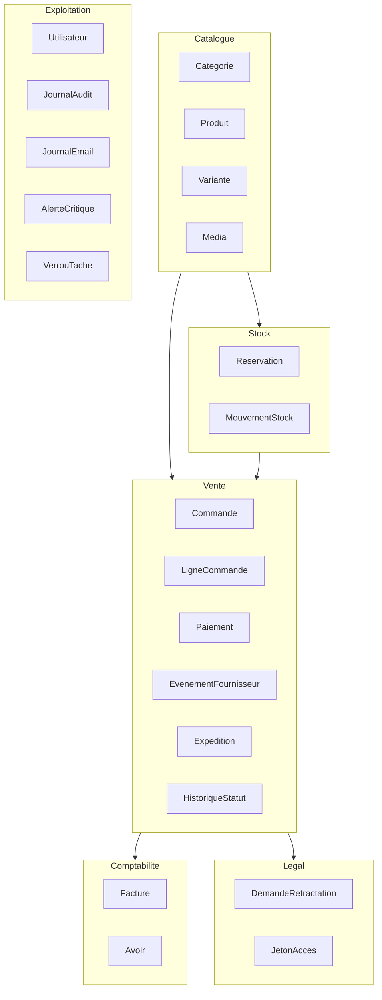
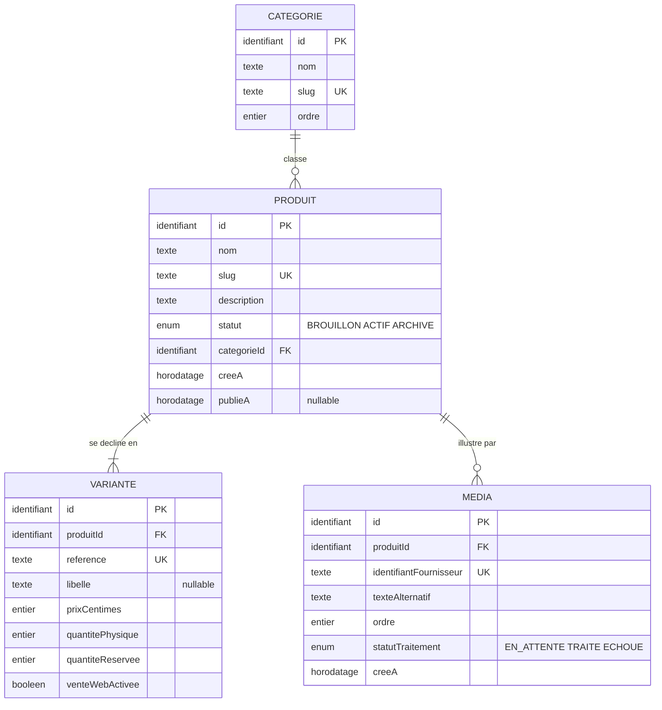
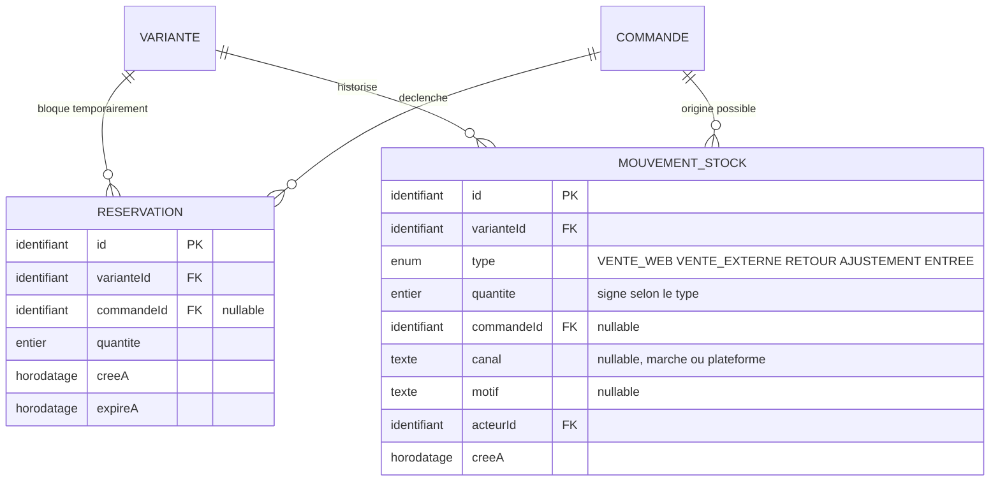
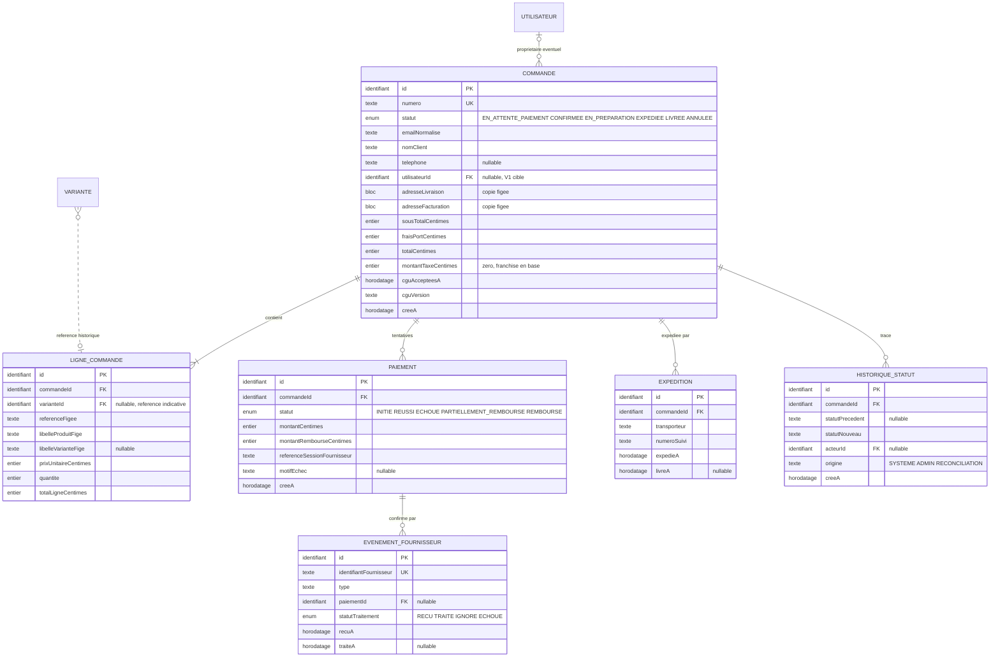
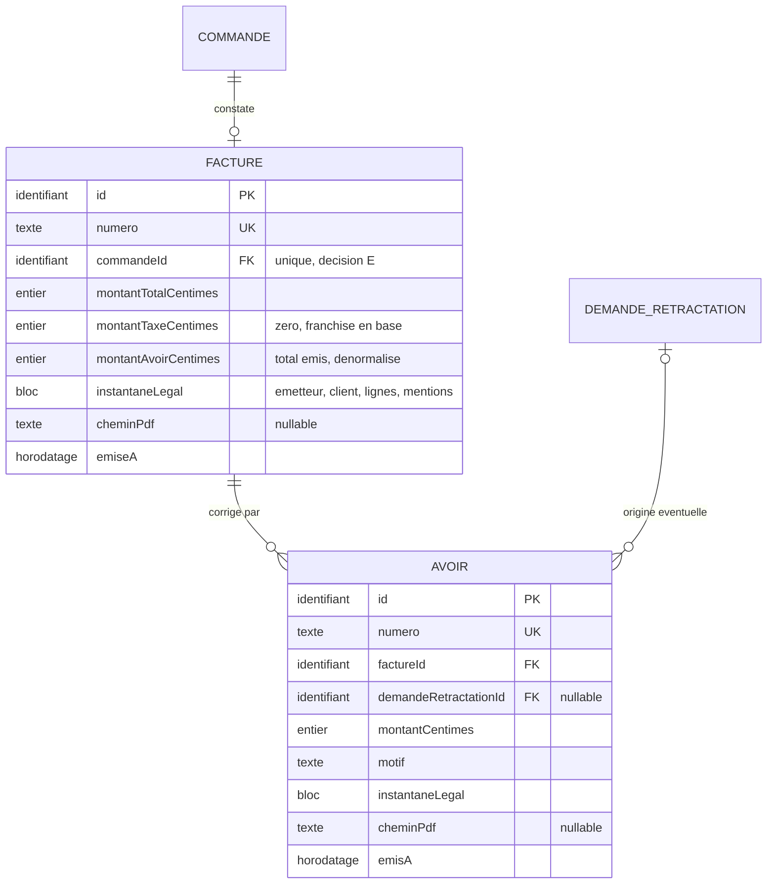
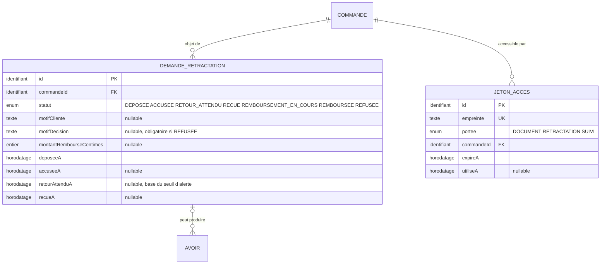
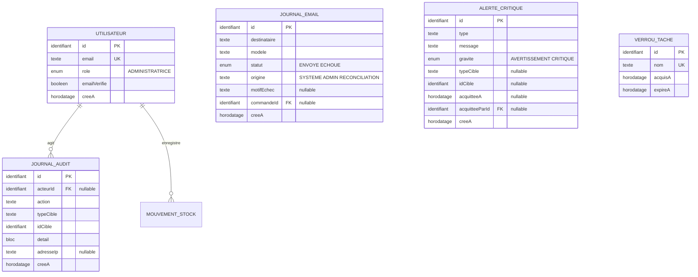

# Modèle conceptuel de données

Entités, associations et cardinalités du périmètre Go-Live, avec les règles de
gestion qui les justifient.

| Champ | Valeur |
|---|---|
| Ticket | LS-12 |
| Entrées | `PARCOURS.md` (LS-11), ADR-006, cahier des charges V1.0 sections 11 et 15 |
| Débloque | LS-13 modèle logique, LS-14 diagramme de séquence |

Ce document décrit **quoi** est stocké et **pourquoi**. Il ne décrit ni les types
SQL, ni les index, ni les noms de colonnes physiques : cela relève de LS-13.

## Niveau d'abstraction

Un modèle conceptuel répond à trois questions et à trois seulement : quelles
entités existent, comment elles se relient, quelles règles les gouvernent. Le
choix d'un `Int` ou d'un `BigInt`, la stratégie d'indexation et la génération
Prisma appartiennent au modèle logique.

La séparation a une raison pratique. Une erreur de type se corrige par une
migration. Une erreur de structure conceptuelle, comme une facture qui dépend du
catalogue actuel, se paie par une reprise de données historiques.

## Principe directeur

Trois règles gouvernent chaque choix ci-dessous.

**Une donnée qui engage juridiquement est recopiée, jamais référencée.** Une
commande, une facture et un avoir figent ce qu'ils constatent. Le catalogue, le
prix et l'adresse peuvent changer après coup sans qu'aucun document émis ne
bouge.

**Un invariant se garantit par une contrainte de base, pas par du code.** Sous
concurrence, une vérification applicative arrive toujours trop tard. Chaque
invariant du projet est donc rattaché à une unicité ou à un `CHECK`.

**Aucune entité n'est créée pour un usage futur hypothétique.** Le plan directeur
écarte la modélisation anticipée de la V1 cible. Seule exception assumée : le
champ propriétaire de commande, sans lequel le parcours 6 exigerait une migration
sur des commandes réelles.

---

## Vue d'ensemble

Six domaines. Les flèches indiquent la dépendance, pas la chronologie.

---

## Domaine 1, catalogue

### Diagramme

### Règles de gestion

| # | Règle | Garantie |
|---|---|---|
| C1 | Un produit a au moins une variante | cardinalité `1..n`, contrôlée à la publication |
| C2 | La référence de variante est unique dans toute la boutique | `UNIQUE` |
| C3 | Le `slug` de produit et de catégorie est unique | `UNIQUE` |
| C4 | Le prix est en centimes entiers | invariant 1, type entier |
| C5 | La quantité physique et la quantité réservée sont positives ou nulles | deux `CHECK` |
| C6 | La quantité réservée ne dépasse jamais la quantité physique | `CHECK`, ADR-006 |
| C7 | Un produit ne passe à `ACTIF` qu'avec un média traité et un texte alternatif | contrôle applicatif à la publication, parcours 3 |
| C8 | Un média non traité n'est jamais servi publiquement | `statutTraitement` distinct de `TRAITE` bloque la publication |
| C9 | Un produit a au plus un média de rang 1 | `UNIQUE (produitId)` filtré sur `ordre = 1` |
| C10 | Le média principal est celui de rang 1 | dérivé, aucun champ dédié |
| C11 | Archiver un produit ne modifie aucune ligne de commande existante | les lignes portent une copie figée, voir décision C |
| C12 | `venteWebActivee` ne crée aucun mouvement de stock | invariant 6, aucune écriture dans `MouvementStock` |

### Pourquoi la variante et non le produit porte le stock

Le stock, le prix et la référence sont des attributs de la chose vendue, pas de
sa présentation. Une paire de boucles d'oreilles existe parfois en deux
longueurs : deux variantes, deux stocks, un seul produit. Porter le stock sur le
produit interdirait ce cas et obligerait à une migration dès la première
déclinaison.

Les pièces uniques restent le cas dominant : une variante, `quantitePhysique` à
un.

### Pourquoi `quantiteReservee` est dénormalisée

Compter les réservations actives à la demande rendrait la condition de
réservation non atomique. ADR-006 le démontre par prototype : seule une colonne
sur la variante permet l'`UPDATE` conditionnel en une instruction.

La contrepartie est un risque de dérive entre la colonne et la somme réelle des
réservations. Trois opérations transactionnelles la maintiennent, et un contrôle
de cohérence périodique peut la vérifier.

### Pourquoi il n'y a pas de champ « média principal »

Un booléen `estPrincipal` à côté d'un `ordre` encode deux fois la même
information, et rien n'empêche structurellement deux médias de porter le booléen
à vrai, ni aucun de le porter.

Le cas se produit sans malveillance. L'administratrice change de photographie
principale depuis son téléphone en mauvaise réception : la requête qui met
l'ancienne à faux échoue, celle qui met la nouvelle à vrai réussit. Le produit a
deux médias principaux, et la fiche affiche l'un ou l'autre selon l'ordre de tri
que PostgreSQL renvoie, qui n'est pas déterministe sans tri explicite.

Le média principal est donc celui de rang 1, et l'unicité porte sur ce seul rang :
`UNIQUE (produitId)` filtré sur `ordre = 1`.

Une unicité sur `(produitId, ordre)` tout entier aurait été plus stricte et plus
coûteuse. PostgreSQL vérifie une contrainte d'unicité à chaque instruction et non
en fin de transaction : permuter deux rangs échouerait dès la première écriture,
même à l'intérieur d'une transaction. Il faudrait alors une contrainte différée
ou une écriture en une seule instruction, complexité inutile puisque l'ordre exact
des vignettes secondaires n'a aucune conséquence. Seul le rang 1 en a une.

### Le média appartient au produit, pas à la variante

Simplification assumée pour le Go-Live. Les variantes d'un même bijou partagent
les mêmes photographies dans la pratique observée. Si une variante devait porter
ses propres images, une table de liaison `MEDIA_VARIANTE` s'ajouterait sans
toucher à l'existant.

---

## Domaine 2, stock

### Diagramme

### Règles de gestion

| # | Règle | Garantie |
|---|---|---|
| S1 | Une réservation expire, elle ne dure pas | `expireA` obligatoire, 30 minutes, parcours 1 |
| S2 | La réservation et l'incrément de `quantiteReservee` sont une seule transaction | ADR-006 |
| S3 | Libérer une réservation expirée décrémente `quantiteReservee` et supprime la ligne | transaction unique, tâche toutes les 5 minutes |
| S4 | Un mouvement de stock est immuable | aucune mise à jour ni suppression, invariant 3 |
| S5 | Une vente externe est refusée si une réservation active existe sur la variante | contrôle applicatif, parcours 2 |
| S6 | Seule une vente réelle décrémente `quantitePhysique` | invariant 6 |
| S7 | Une commande produit au plus un mouvement `VENTE_WEB` par variante | `UNIQUE` partiel sur `(commandeId, varianteId)` filtré sur `type = VENTE_WEB`, voir décision D |
| S8 | La réintégration de stock dépend du retour physique, jamais du remboursement | parcours 4 et 5 |

### Pourquoi la réservation est une entité et non un champ

Trois raisons. Une réservation a une durée de vie propre, indépendante de la
commande. Elle peut exister sans commande confirmée. Et le parcours 2 exige de
savoir **si** une réservation active existe sur une variante avant d'autoriser
une vente en main propre, ce qu'un champ sur la commande ne permet pas
d'interroger.

### Pourquoi le mouvement de stock est un journal immuable

Le stock actuel est une conséquence de son histoire, pas une donnée
indépendante. Un journal permet de répondre à « pourquoi cette pièce est-elle à
zéro », de distinguer une vente web d'une vente de marché, et de reconstruire la
quantité physique en cas de doute. Une simple colonne compteur ne le permet pas.

Le signe de la quantité porte le sens : négatif pour une sortie, positif pour une
entrée ou un retour. Le type documente la cause.

---

## Domaine 3, vente

### Diagramme

### Règles de gestion

| # | Règle | Garantie |
|---|---|---|
| V1 | Le numéro de commande est unique | `UNIQUE` |
| V2 | Une commande a au moins une ligne | cardinalité `1..n` |
| V3 | Une ligne de commande est immuable après confirmation | invariant 3 |
| V4 | Une ligne porte une copie figée de la référence, du libellé et du prix | invariant 3, parcours 3 |
| V5 | Statut de commande et statut de paiement sont deux axes indépendants | décision A ci-dessous |
| V6 | Un événement fournisseur ne produit son effet métier qu'une fois | `UNIQUE` sur `identifiantFournisseur`, invariant 5 |
| V7 | Seul un événement serveur signé confirme un paiement | invariant 5, le retour navigateur ne prouve rien |
| V8 | Une commande peut porter plusieurs tentatives de paiement | décision B ci-dessous |
| V9 | Les montants sont en centimes entiers | invariant 1 |
| V10 | L'acceptation des conditions est horodatée avec sa version | preuve du consentement |
| V11 | Le passage à `LIVREE` exige une source fiable | parcours 1, étape 12 |
| V12 | Toute transition de statut est tracée avec son acteur et son origine | historisation, parcours 1 |
| V13 | `utilisateurId` reste nul au lancement, il n'autorise rien | invariant 2, parcours 6 |
| V14 | Une commande porte au plus un paiement `REUSSI` | `UNIQUE` partiel sur `(commandeId)` filtré sur `statut = REUSSI`, voir décision D |

### Décision A, séparer statut de commande et statut de paiement

Un statut unique produirait des états composites ingérables : « payée mais
partiellement remboursée et en préparation » n'est pas un état, c'est la
combinaison de deux axes.

Les deux axes évoluent indépendamment. Une commande peut être `EXPEDIEE` avec un
paiement `PARTIELLEMENT_REMBOURSE`. Un paiement peut être `ECHOUE` sans que la
commande quitte `EN_ATTENTE_PAIEMENT`, le client pouvant réessayer.

### Décision B, le paiement est une entité

Le parcours 1 prévoit explicitement le refus suivi d'un nouvel essai. Des
colonnes de paiement portées par la commande écraseraient la tentative refusée,
donc la trace du motif d'échec, utile au support comme au diagnostic.

Une commande porte ainsi zéro à n paiements. Au plus un est en statut `REUSSI`,
garanti par une unicité en base et non par du code, voir décision D.

### Décision C, la ligne de commande référence la variante sans en dépendre

`varianteId` existe et reste utile pour les statistiques et les liens de
l'administration. Il est **nullable** et **jamais lu pour afficher une commande**.

Tout ce qu'une commande affiche vient de ses copies figées. Si le produit est
archivé, renommé ou si son prix change, la commande et sa facture restent
exactes. C'est l'invariant 3 traduit en structure.

### Décision D, l'idempotence a besoin de deux clés, pas d'une

L'unicité sur `EvenementFournisseur.identifiantFournisseur` protège du rejeu du
**même** événement. Elle ne protège pas de deux chemins d'entrée distincts vers
le même effet métier, et le parcours 1 en prévoit exactement deux.

Le scénario. Une commande reste `EN_ATTENTE_PAIEMENT` depuis soixante-deux
minutes parce que le webhook n'est jamais arrivé. La réconciliation interroge le
prestataire, trouve le paiement, régularise la commande et crée le mouvement de
stock. Quarante secondes plus tard le webhook arrive enfin, retardé par une file
d'attente chez le prestataire. Son identifiant n'a jamais été vu : l'unicité ne
le rejette pas. Il crée un second mouvement de stock et décrémente une seconde
fois la quantité physique.

Sur une pièce unique, la contrainte `CHECK` fait échouer la transaction, donc une
erreur serveur au lieu d'un traitement propre. Sur une variante à trois
exemplaires, rien n'échoue : le stock est simplement faux.

L'idempotence doit donc être ancrée sur l'**effet** autant que sur l'événement.
L'étape 7 du parcours 1 en produit quatre, et chacun a besoin de sa propre clé :

| Effet | Clé d'unicité |
|---|---|
| paiement confirmé | `paiement (commandeId)` filtré sur `statut = REUSSI` |
| stock décrémenté | `mouvement_stock (commandeId, varianteId)` filtré sur `type = VENTE_WEB` |
| facture émise | `facture (commandeId)`, voir décision E |
| email envoyé | `journal_email (commandeId, modele)` filtré sur `origine = SYSTEME` |

Les deux chemins convergent alors vers le même refus en base, quel que soit celui
qui arrive en second, et sans dépendre de l'ordre des écritures dans la
transaction. C'est la traduction du principe directeur : sous concurrence, une
vérification applicative arrive toujours trop tard.

**La clé du mouvement de stock porte la variante, pas seulement la commande.**
Un panier à deux articles décrémente deux variantes distinctes, donc produit deux
mouvements. Une unicité sur la seule commande rejetterait le second et rendrait
tout panier multi-articles impossible à confirmer. Le couple commande et variante
garde l'idempotence recherchée, le webhook tardif retentant les mêmes couples.

**La clé de l'email exclut les renvois manuels.** Le parcours 1 prévoit qu'une
administratrice renvoie un email après un échec. Filtrer sur `origine = SYSTEME`
laisse ce renvoi passer tout en bloquant le doublon automatique. `JournalEmail`
porte donc une `origine`, aux mêmes valeurs que celle de `HistoriqueStatut`.

### Pourquoi l'adresse est recopiée dans la commande

Arbitré avec Christophe le 28 juillet 2026. Une table `Adresse` référencée
laisserait une modification d'adresse altérer rétroactivement une facture émise,
ce qui viole les invariants 3 et 4.

Le carnet d'adresses de la V1 cible ajoutera une table sans migrer l'historique :
les commandes passées gardent leur copie, les nouvelles recopient depuis le
carnet.

### Pourquoi il n'y a pas d'entité Client

Arbitré avec Christophe le 28 juillet 2026. L'achat sans compte est le seul mode
au lancement. La commande porte l'email normalisé, le nom et le téléphone.

Regrouper les commandes par email **avant** vérification créerait un accès aux
commandes d'autrui dès que deux personnes partagent une adresse, ou qu'une
adresse est saisie par erreur. Le parcours 6 impose d'ailleurs la vérification
préalable de l'email : le regroupement n'existe qu'après elle.

---

## Domaine 4, comptabilité

### Diagramme

### Règles de gestion

| # | Règle | Garantie |
|---|---|---|
| F1 | Une facture n'est jamais modifiée ni supprimée | invariant 4 |
| F2 | Une correction produit un avoir, jamais une modification de facture | invariant 4, parcours 4 |
| F3 | Factures et avoirs ont deux séquences de numérotation distinctes | parcours 4 |
| F4 | Le numéro est attribué dans la transaction de création | invariant 4, aucun trou en cas d'échec |
| F5 | Une facture n'existe qu'après confirmation du paiement | parcours 1, étape 8 |
| F6 | Une commande porte au plus une facture | `UNIQUE` sur `facture.commandeId`, voir décision E |
| F7 | Une facture porte un instantané légal complet | indépendance totale vis-à-vis du catalogue et du paramétrage |
| F8 | Le PDF manquant n'invalide pas le document | parcours 4, régénération sans réattribution de numéro |
| F9 | La somme des avoirs d'une facture ne dépasse jamais son montant | `CHECK montantAvoirCentimes <= montantTotalCentimes`, voir décision F |
| F10 | Un avoir issu d'une rétractation référence sa demande | `demandeRetractationId`, nul pour un geste commercial |

### Pourquoi l'instantané légal est stocké et non recalculé

Une facture doit rester lisible à l'identique pendant dix ans. Elle mentionne la
raison sociale de l'émetteur, son numéro SIRET, l'adresse du client et la mention
de franchise en base de TVA. Tous ces éléments peuvent changer.

Recalculer une facture à l'affichage produirait, après un déménagement ou un
franchissement du seuil de franchise, un document différent de celui qui a été
envoyé au client. L'instantané rend le document indépendant de l'état actuel
du système.

### Décision E, l'unicité de facture par commande est une contrainte, pas une cardinalité

Écrire `0..1` dans un diagramme est une affirmation, pas une garantie. Sans
unicité en base sur `facture.commandeId`, deux factures peuvent naître sur la
même commande.

Le chemin est concret. Le parcours 1 prévoit la régénération manuelle d'une
facture après un échec de génération. L'administratrice clique deux fois sur une
connexion lente : deux transactions démarrent, chacune consomme un numéro,
chacune insère. Deux documents comptables valides pour une seule vente. Les
corriger exige un avoir, donc une écriture de correction pour une erreur
applicative.

Le même croisement survient si le webhook et la réconciliation traitent la même
commande en parallèle, ce que la décision D vient de traiter côté paiement.

### Décision F, le total des avoirs est porté par la facture

Sans borne, la somme des avoirs peut dépasser la facture. Le cas ne demande
aucune malveillance : facture de 12 000 centimes, premier avoir de 8 000, puis
un second saisi à 12 000 au lieu de 4 000 parce que le formulaire propose le
montant de la facture par défaut. Total de 20 000 remboursés sur une vente de
12 000, sans qu'aucune alerte ne se déclenche. La déclaration de chiffre
d'affaires devient fausse en silence.

La facture porte donc `montantAvoirCentimes`, maintenu dans la transaction qui
crée l'avoir, avec un `CHECK` qui le borne au montant total. C'est le motif déjà
retenu pour `quantiteReservee` sur la variante, arbitré avec Christophe le 28
juillet 2026 : une colonne dénormalisée protégée par une contrainte bat un
agrégat vérifié par du code, parce que la contrainte tient sous concurrence.

La contrepartie est la même qu'au domaine stock, un risque de dérive si une
opération oublie de mettre la colonne à jour. La parade est identique : une seule
transaction est autorisée à créer un avoir, et elle met les deux à jour ensemble.

### Pourquoi l'avoir référence la facture et non la commande

Le parcours 4 prévoit deux avoirs successifs sur une même facture, lors d'un
remboursement partiel suivi d'un second. Un avoir corrige un document émis, pas
une transaction commerciale. Cardinalité `1..n` depuis la facture.

---

## Domaine 5, légal

### Diagramme

### Règles de gestion

| # | Règle | Garantie |
|---|---|---|
| L1 | La date de dépôt de la rétractation est conservée telle quelle | preuve légale, parcours 5 |
| L2 | Un refus exige un motif documenté | contrôle applicatif, `motifDecision` obligatoire |
| L3 | Aucune exclusion de rétractation n'est codée en dur | parcours 5, le droit s'applique au cas concret |
| L4 | Un numéro de commande seul n'identifie jamais un contrat | invariant 2, parcours 5 |
| L5 | Un jeton porte une empreinte, jamais sa valeur en clair | invariant 9 |
| L6 | Un jeton expire, et sa portée est limitée à un usage | principe de moindre privilège |
| L7 | Le remboursement suppose la réception du retour | parcours 5, aucun automatisme |
| L8 | Chaque étape de la demande porte son propre horodatage | le seuil d'alerte se calcule depuis `retourAttenduA`, voir ci-dessous |

### Pourquoi le jeton d'accès est une entité générique

Trois usages exigent un accès sans compte : consulter une facture, déposer une
rétractation, suivre une commande. Trois entités séparées répéteraient la même
structure et le même risque.

Une entité unique avec une portée permet de révoquer, d'expirer et de tracer
uniformément. Le stockage d'une empreinte, jamais de la valeur en clair, suit le
traitement d'un mot de passe : une fuite de base ne donne aucun accès.

### Pourquoi chaque étape porte son horodatage

Le parcours 5 prévoit une alerte quand un colis annoncé n'arrive jamais. Le seuil
se calcule à partir du moment où le retour est réellement attendu, pas du dépôt
de la demande.

Les deux dates coïncident presque sur le chemin nominal. Elles divergent dès que
l'accusé de réception échoue : la demande reste `DEPOSEE`, et le passage en
`RETOUR_ATTENDU` peut n'intervenir que cinq jours plus tard, après renvoi manuel.
Un seuil calculé depuis `deposeeA` alerterait alors cinq jours trop tôt, sur une
client qui n'a jamais reçu ses instructions de retour.

`retourAttenduA` et `recueA` s'ajoutent donc à `deposeeA` et `accuseeA`. Cette
demande a peu d'états et une durée de vie courte : quatre horodatages suffisent,
là où la commande justifie un historique de transitions séparé.

### Le calcul du délai de rétractation n'est pas modélisé ici

`PARCOURS.md` laisse ce point ouvert et le cahier des charges interdit de décider
d'une obligation juridique sans vérification aux sources. Le modèle conserve les
horodatages nécessaires au calcul, il ne fige aucune règle de calcul.

---

## Domaine 6, exploitation

### Diagramme

Les entités d'authentification proprement dites (session, passkey, jeton de
vérification) sont fournies par Better Auth et modélisées en LS-13, conformément
à ADR-021. Elles ne figurent pas ici parce qu'elles ne portent aucune règle
métier propre au projet.

### Règles de gestion

| # | Règle | Garantie |
|---|---|---|
| E1 | Un seul compte administratrice au lancement | ADR-021 |
| E2 | L'identité vient de la session ou d'un jeton signé | invariant 2 |
| E3 | Toute action administrative sensible est tracée | journal d'audit |
| E4 | Un échec d'email ne bloque jamais une commande | parcours 1, journal séparé |
| E5 | Un même email automatique n'est jamais envoyé deux fois pour une commande | `UNIQUE (commandeId, modele)` filtré sur `origine = SYSTEME`, décision D |
| E6 | Un renvoi manuel reste possible après un échec | `origine` distingue `ADMIN` de `SYSTEME`, parcours 1 |
| E7 | Une alerte critique est acquittable, jamais supprimée | parcours 1 et 4 |
| E8 | Le nom de verrou de tâche est unique | `UNIQUE`, exécution unique |
| E9 | Les horodatages sont persistés en UTC | invariant 8 |

### Pourquoi une table de verrou

Deux tâches planifiées tournent : la libération des réservations expirées toutes
les cinq minutes, la réconciliation des paiements toutes les quinze minutes.

Sans verrou, deux instances de l'application les exécuteraient simultanément.
Pour la libération, cela produirait une double décrémentation de
`quantiteReservee`. Le projet n'utilisant pas Redis (section 5.3 du cahier des
charges), le verrou vit en base avec une expiration, ce qui évite le blocage
permanent si une instance meurt en cours de tâche.

---

## Vérification, traversée des six parcours

Critère de la porte de sortie : chaque parcours de `PARCOURS.md` se déroule
entièrement, cas d'erreur compris, sans invention de champ manquant.

### Parcours 1, achat de référence

| Étape | Entités mobilisées | Couvert |
|---|---|---|
| 1 consultation | `Produit`, `Variante`, `Media`, `Categorie` | oui |
| 2 panier | aucune, éphémère côté client | oui |
| 3 revalidation | lecture `Variante` | oui |
| 4 réservation | `Reservation`, `Variante.quantiteReservee` | oui |
| 5 commande | `Commande`, `LigneCommande`, `cguAccepteesA` | oui |
| 6 session paiement | `Paiement.referenceSessionFournisseur` | oui |
| 7 événement signé | `EvenementFournisseur`, `Paiement`, `Commande`, `MouvementStock` | oui |
| 8 facture | `Facture` avec instantané | oui |
| 9 emails | `JournalEmail`, deux entrées | oui |
| 10 préparation | `Commande.statut`, `HistoriqueStatut` | oui |
| 11 expédition | `Expedition` | oui |
| 12 livraison | `Expedition.livreA`, `Commande.statut` | oui |

| Cas d'erreur | Entité ou champ porteur | Couvert |
|---|---|---|
| stock insuffisant | aucune écriture, `UPDATE` sans ligne | oui |
| prix modifié | lecture `Variante`, aucune écriture | oui |
| abandon | `Reservation.expireA`, `VerrouTache` | oui |
| paiement refusé | `Paiement.statut` `ECHOUE`, `motifEchec` | oui |
| événement jamais reçu | `Commande.creeA`, réconciliation, `HistoriqueStatut.origine` | oui |
| événement rejoué | `EvenementFournisseur.identifiantFournisseur` `UNIQUE` | oui |
| webhook tardif après réconciliation | quatre clés d'idempotence sur paiement, mouvement, facture et email, décision D | oui |
| signature invalide | `JournalAudit`, aucun effet métier | oui |
| échec email | `JournalEmail.statut` `ECHOUE`, `motifEchec` | oui |
| facture en échec | `AlerteCritique`, commande sans facture | oui |

### Parcours 2, stock en situation de marché

| Élément | Entité | Couvert |
|---|---|---|
| suspension vente web | `Variante.venteWebActivee`, `JournalAudit` | oui |
| contrôle réservation active | `Reservation` interrogeable par variante | oui |
| vente externe | `MouvementStock` type `VENTE_EXTERNE`, `canal` | oui |
| retour d'invendu | `venteWebActivee` à vrai, aucun mouvement | oui |
| annulation forcée de réservation | suppression `Reservation`, `JournalAudit` | oui |
| stock déjà à zéro | `CHECK` sur `quantitePhysique` | oui |

### Parcours 3, création de produit

| Élément | Entité | Couvert |
|---|---|---|
| brouillon | `Produit.statut` `BROUILLON` | oui |
| variante | `Variante`, `reference` `UNIQUE` | oui |
| média | `Media.identifiantFournisseur`, `statutTraitement` | oui |
| texte alternatif | `Media.texteAlternatif` obligatoire | oui |
| média principal | `Media.ordre` à 1, `UNIQUE (produitId)` filtré sur `ordre = 1` | oui |
| publication | `Produit.statut` `ACTIF`, `publieA` | oui |
| référence déjà utilisée | `UNIQUE` | oui |
| téléversement interrompu | `Media.statutTraitement` `EN_ATTENTE` et `creeA` pour la purge en base ; le résidu **chez le fournisseur** exige un rapprochement, hors modèle | partiel, voir ci-dessous |
| traitement en échec | `statutTraitement` `ECHOUE`, publication refusée | oui |
| archivage | `Produit.statut` `ARCHIVE`, lignes figées intactes | oui |

### Parcours 4, facture et remboursement

| Élément | Entité | Couvert |
|---|---|---|
| facture | `Facture`, numéro dans la transaction | oui |
| envoi | `JournalEmail` | oui |
| remboursement | `Paiement.statut`, `montantRembourseCentimes` | oui |
| avoir | `Avoir`, séquence distincte, référence facture | oui |
| réintégration | `MouvementStock` type `RETOUR` | oui |
| remboursement refusé | `Paiement` inchangé, `JournalAudit` | oui |
| échec d'attribution | rollback, aucun numéro consommé | oui |
| second remboursement | second `Avoir` sur la même facture | oui |
| double génération de facture | `UNIQUE` sur `facture.commandeId`, décision E | oui |
| avoirs dépassant la facture | `Facture.montantAvoirCentimes` et son `CHECK`, décision F | oui |
| pièce non retournée | aucun `MouvementStock` | oui |
| PDF en échec | `Facture.cheminPdf` nul, `AlerteCritique` | oui |

### Parcours 5, rétractation

| Élément | Entité | Couvert |
|---|---|---|
| accès permanent | `JetonAcces` portée `RETRACTATION` | oui |
| identification du contrat | `JetonAcces.empreinte`, jamais le numéro seul | oui |
| déclaration | `DemandeRetractation`, `motifCliente` | oui |
| accusé de réception | `statut` `ACCUSEE`, `accuseeA`, `JournalEmail` | oui |
| suivi du retour | `statut` et `retourAttenduA`, puis `RECUE` et `recueA` | oui |
| remboursement | `Paiement`, `Avoir.demandeRetractationId`, décision F | oui |
| réintégration | `MouvementStock` type `RETOUR` | oui |
| jeton expiré | `expireA`, `JournalAudit` | oui |
| délai dépassé | horodatages conservés, règle non figée | oui |
| échec de l'accusé | `JournalEmail` `ECHOUE`, `AlerteCritique` | oui |
| colis jamais reçu | `retourAttenduA` comme base du seuil, `AlerteCritique` | oui |
| pièce endommagée | `montantRembourseCentimes`, `motifDecision` | oui |
| refus | `statut` `REFUSEE`, `motifDecision` obligatoire | oui |

### Parcours 6, rattachement d'une commande

| Élément | Entité | Couvert |
|---|---|---|
| création de compte | `Utilisateur`, `emailVerifie` faux | oui |
| vérification email | `emailVerifie` vrai, entité Better Auth | oui |
| recherche éligible | `Commande.emailNormalise`, `utilisateurId` nul | oui |
| rattachement | `Commande.utilisateurId`, `JournalAudit` | oui |
| email non vérifié | `emailVerifie` faux bloque | oui |
| commande déjà rattachée | `utilisateurId` non nul exclut | oui |
| identifiant fourni | éligibilité calculée en session, invariant 2 | oui |

**Résultat : les six parcours et leurs trente-deux cas d'erreur se déroulent sans
champ manquant.**

Le trente-deuxième cas est né de cette modélisation. `PARCOURS.md` en comptait
trente et un : l'événement de paiement tardif arrivant après une régularisation
par réconciliation n'y figurait pas, aucune des deux listes de cas d'erreur du
cahier des charges ne le contenant. Il est désormais documenté au parcours 1, et
la décision D porte les quatre clés qui le neutralisent.

---

## Récapitulatif des contraintes issues du modèle

Ces contraintes passent en LS-13 pour traduction en migration.

Ces contraintes passent en LS-13 pour traduction en migration. Elles se lisent en
trois niveaux, du plus fort au plus faible, et le niveau compte autant que la
contrainte : une garantie de base tient sous concurrence, une garantie de
transaction tient si le code respecte la transaction, un contrôle applicatif ne
tient que si personne ne l'oublie.

### Niveau 1, garanti par la base

**Unicité simple** : `produit.slug`, `categorie.slug`, `variante.reference`,
`commande.numero`, `facture.numero`, `avoir.numero`, `facture.commandeId`,
`evenement_fournisseur.identifiant_fournisseur`, `verrou_tache.nom`,
`jeton_acces.empreinte`, `media.identifiant_fournisseur`, `utilisateur.email`.

**Unicité partielle**, sans laquelle un invariant retomberait sur du code
applicatif. Les quatre dernières portent l'idempotence de la décision D :

| Contrainte | Filtre | Empêche |
|---|---|---|
| `media (produitId)` | `ordre = 1` | deux médias principaux sur un produit |
| `paiement (commandeId)` | `statut = REUSSI` | deux paiements réussis sur une commande |
| `mouvement_stock (commandeId, varianteId)` | `type = VENTE_WEB` | double décrément par webhook et réconciliation |
| `journal_email (commandeId, modele)` | `origine = SYSTEME` | email de confirmation envoyé deux fois |

**Contrôles de valeur** : `quantite_physique >= 0`, `quantite_reservee >= 0`,
`quantite_physique - quantite_reservee >= 0`, `ligne_commande.quantite > 0`,
tout montant en centimes `>= 0`, `montant_rembourse <= montant` sur le paiement,
`facture.montant_avoir_centimes <= facture.montant_total_centimes`.

**Obligatoire, aucune valeur nulle** : `avoir.factureId`, `facture.commandeId`,
`ligne_commande.commandeId`, `paiement.commandeId`, `reservation.varianteId`,
`mouvement_stock.varianteId`, `demande_retractation.commandeId`,
`jeton_acces.commandeId`, `variante.produitId`, `media.produitId`,
`produit.categorieId`.

**Expiration obligatoire**, sans laquelle une ressource se bloque indéfiniment :
`reservation.expireA` (stock bloqué à vie), `jeton_acces.expireA` (accès
permanent à un document), `verrou_tache.expireA` (tâche jamais rejouée si une
instance meurt en cours).

### Niveau 2, garanti par la transaction

Ces propriétés ne s'expriment pas en contrainte de colonne. Elles doivent être
portées par le code de la transaction, et testées.

| # | Propriété |
|---|---|
| F4 | Le numéro de facture ou d'avoir est attribué dans la transaction de création |
| S2 | La réservation et l'incrément de `quantiteReservee` sont indissociables |
| S3 | La libération décrémente et supprime ensemble |
| S5 | La vente externe contrôle l'absence de réservation active avant d'écrire |
| F9 | La création d'un avoir met à jour `facture.montantAvoirCentimes` en même temps |

### Niveau 3, contrôlé par l'application

Volontairement hors contrainte, parce que l'état intermédiaire est légitime. Un
brouillon incomplet doit pouvoir exister.

| # | Contrôle | Moment |
|---|---|---|
| C1 | Un produit a au moins une variante | à la publication |
| C7 | Média traité et texte alternatif présents | à la publication |
| C8 | Aucun média non traité servi publiquement | à la lecture publique |
| L2 | Motif obligatoire sur un refus de rétractation | à la transition |

### Immuabilité et suppression

**Immuable après écriture** : `MouvementStock`, `Facture`, `Avoir`,
`HistoriqueStatut`, `EvenementFournisseur`, et `LigneCommande` après
confirmation.

**Suppression** : aucune suppression destructive sur les entités historiques.
L'archivage remplace la suppression. Seules `Reservation` et `VerrouTache` sont
réellement supprimables, ce sont des entités transitoires.

---

## Ce qui n'est pas modélisé, et pourquoi

Conformément au plan directeur, les entités de la V1 cible attendent leur phase :
avis vérifiés, assistant conversationnel, statistiques, carnet d'adresses,
liste d'envie.

Le panier n'est pas persisté au lancement. Il vit côté client et se revalide
côté serveur à chaque étape, conformément au parcours 1. Le persister exigerait
une entité, une expiration et une purge pour un bénéfice limité tant qu'il n'y a
pas de compte client.

Le message de contact non plus. Une entité `Message` figurait dans une première
version de ce document, sans qu'aucun des six parcours ne la mobilise. Le
principe directeur interdit d'entrer une entité sans parcours qui la justifie,
et l'exception assumée est déjà consommée par `Commande.utilisateurId`. Le
formulaire de contact relève d'un ticket propre, où sa règle principale devra
être posée : le message est persisté avant toute tentative d'envoi d'email,
faute de quoi une panne d'email perd le message.

Les entités d'authentification de Better Auth sont référencées par ADR-021 et
matérialisées en LS-13.

---

## Points ouverts, transmis à LS-13

Le format des numéros de commande, de facture et d'avoir. La contrainte est
connue : séquences distinctes pour factures et avoirs, attribution dans la
transaction, aucun trou.

La forme de stockage des blocs figés, adresse et instantané légal, en colonnes
distinctes ou en document structuré.

**D'où vient la date de livraison**, qui conditionne le point de départ du délai
de rétractation. Le modèle porte `Expedition.livreA` avec la règle « uniquement
sur source fiable », mais la source n'est pas définie : interrogation
automatique du transporteur, saisie par l'administratrice, ou repli sur la date
d'expédition. Question ouverte, LS-33, à trancher avec l'exploitante. Elle ne
bloque pas LS-13, le modèle stocke la date quelle que soit sa provenance.

**Les paramètres d'exploitation** restant à fixer : la libération des
réservations toutes les 5 minutes et la réconciliation toutes les 15 minutes,
issues d'ADR-006 et de `PARCOURS.md`. Le modèle rend ces valeurs configurables,
il persiste `expireA` et non une durée.

## Ce qui a été tranché

Arbitré avec Christophe le 28 juillet 2026, ces points ne sont plus ouverts.

**Expiration d'une réservation : 30 minutes.**

**Alerte sur retour annoncé non reçu : immédiate**, pour permettre de contacter
le transporteur sans attendre. Le champ `retourAttenduA` porte la date de
référence.

**Format des numéros de facture : `F-2026-0001`.** Séquence distincte par type de
document, déclinée sur le même modèle pour les commandes et les avoirs.

**Délai de rétractation : 14 jours à compter de la réception du bien**, article
L221-18 du Code de la consommation, vérifié aux sources officielles. Le jour de
réception ne compte pas et l'échéance est reportée au premier jour ouvrable si
elle tombe un samedi, un dimanche ou un jour férié, article L221-19. En cas de
livraison échelonnée, le délai court à compter du dernier bien reçu.

Le modèle conserve les horodatages nécessaires à ce calcul sans figer la règle,
qui reste portée par le code et testée.

## Périmètre élargi après la rédaction de ce document

Le 28 juillet 2026, Christophe a décidé que l'espace client, les avis vérifiés et
le carnet d'adresses entrent dans le périmètre d'ouverture, epic LS-36.

**L'espace client est déjà couvert par ce document.** `Commande.utilisateurId` et
le parcours 6 avaient été prévus pour cela, aucune migration sur commandes
historiques ne sera nécessaire. Les entités de session et de passkey viennent de
Better Auth et relèvent de LS-13.

**Deux entités manquent, et elles relèvent de LS-37**, une story dédiée qui étend
ce document avant que LS-13 ne le traduise en schéma. Elles ne vont pas
directement en LS-13 : concevoir une entité et la traduire dans le même ticket
mélangerait deux niveaux d'abstraction et ferait passer des décisions
structurantes sans revue.

L'**entité Avis**, écartée ici faute de parcours qui la mobilise. Sa décision
d'ancrage est prise, arbitrée le 28 juillet 2026 : l'avis est rattaché à une
**ligne de commande** et non au produit. La ligne est la preuve d'achat, et elle
est structurelle plutôt que déclarative. Deux achats de la même pièce permettent
deux avis, et l'archivage d'un produit n'invalide aucun avis puisque la ligne
porte sa copie figée.

Conséquence à traiter en LS-37 : regrouper les avis sur une fiche produit suppose
de remonter par `LigneCommande.varianteId`, qui est nullable par conception. Le
cas où il est nul doit être traité explicitement.

La **table Adresse** du carnet, qui sert de source de saisie et **ne remplace
jamais la copie figée dans la commande**. La décision sur l'adresse ne change pas :
une modification du carnet n'altère aucune facture émise.

LS-37 ajoutera aussi un septième parcours dans `PARCOURS.md`, le dépôt d'un avis
avec ses cas d'erreur, au même niveau de détail que les six autres.
