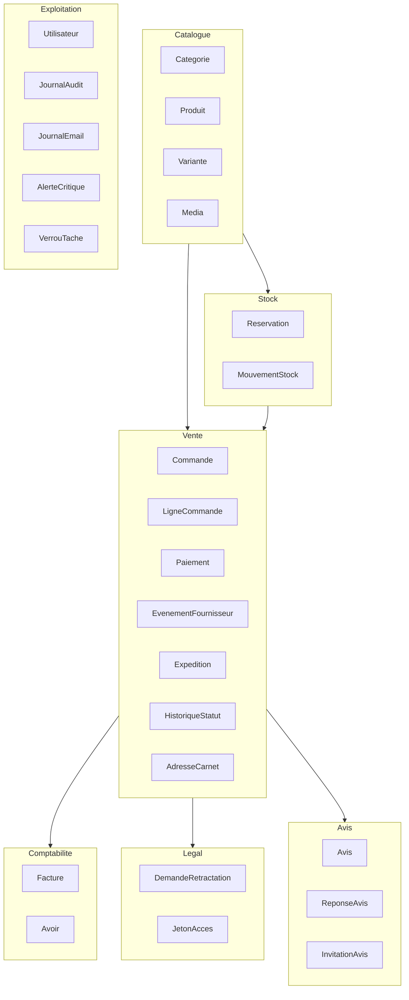
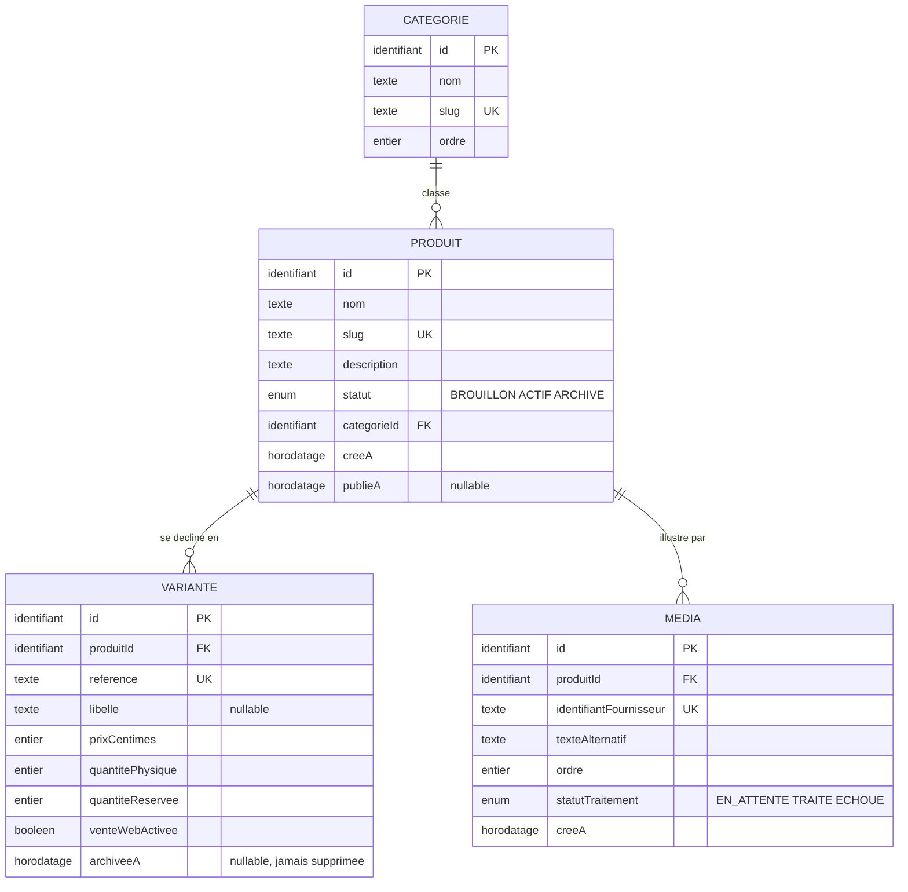
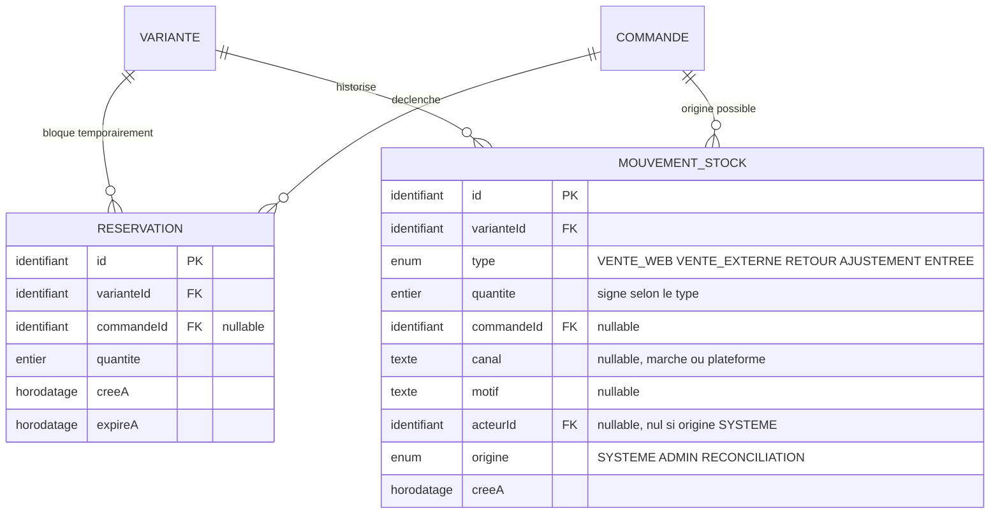
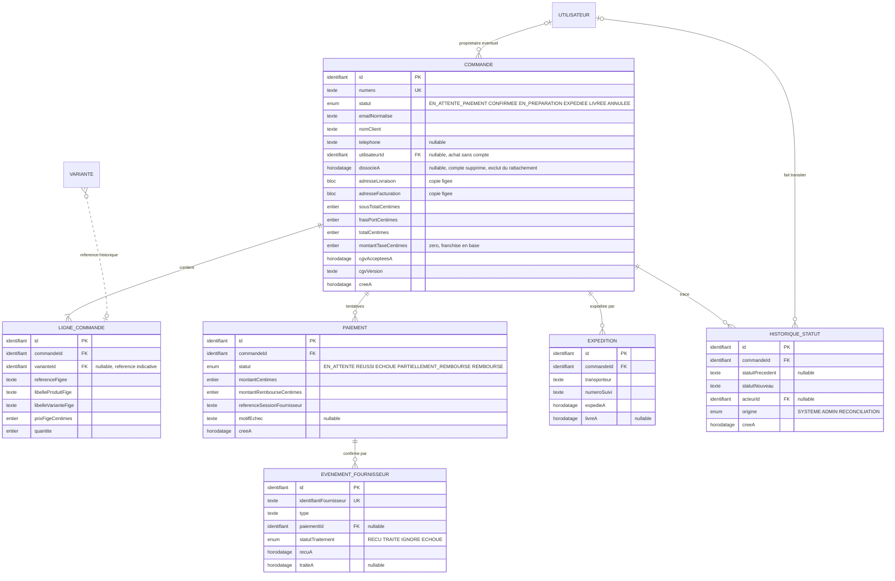
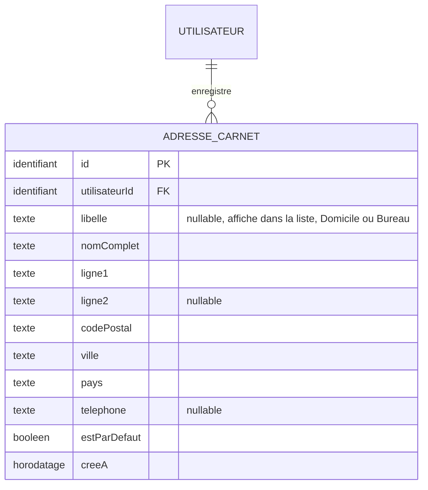
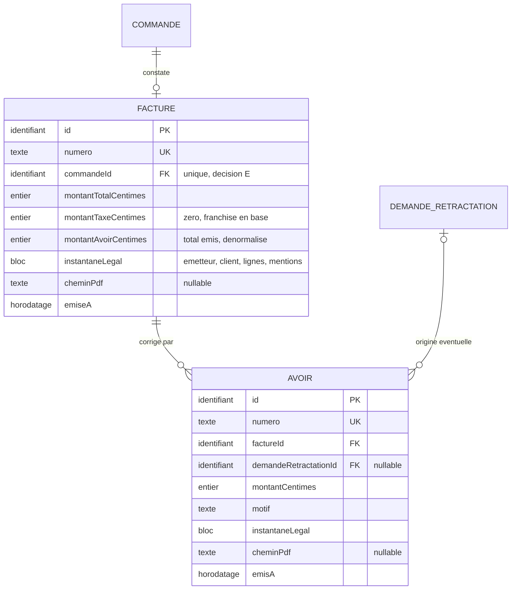
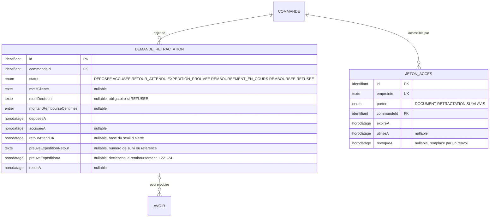
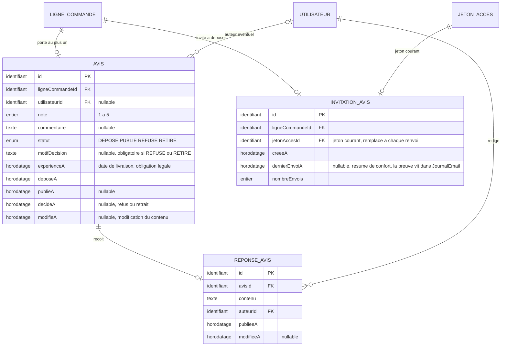
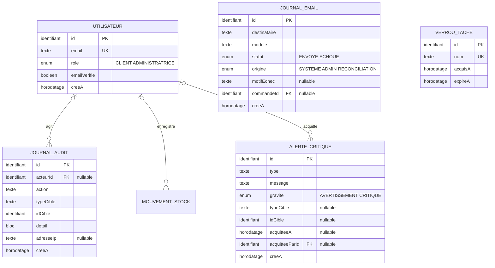

# Modèle conceptuel de données

Entités, associations et cardinalités du périmètre Go-Live, avec les règles de
gestion qui les justifient.

| Champ | Valeur |
|---|---|
| Ticket | LS-12 |
| Entrées | `PARCOURS.md` (LS-11), ADR-006, cahier des charges V1.0 sections 11 et 15 |
| Débloque | LS-13 modèle logique, LS-14 diagramme de séquence |

Ce document décrit **quoi** est stocké et **pourquoi**. Il ne décrit ni les types
SQL, ni les index, ni les noms de colonnes physiques : cela relève de LS-13.

## Niveau d'abstraction

Un modèle conceptuel répond à trois questions et à trois seulement : quelles
entités existent, comment elles se relient, quelles règles les gouvernent. Le
choix d'un `Int` ou d'un `BigInt`, la stratégie d'indexation et la génération
Prisma appartiennent au modèle logique.

La séparation a une raison pratique. Une erreur de type se corrige par une
migration. Une erreur de structure conceptuelle, comme une facture qui dépend du
catalogue actuel, se paie par une reprise de données historiques.

## Principe directeur

Trois règles gouvernent chaque choix ci-dessous.

**Une donnée qui engage juridiquement est recopiée, jamais référencée.** Une
commande, une facture et un avoir figent ce qu'ils constatent. Le catalogue, le
prix et l'adresse peuvent changer après coup sans qu'aucun document émis ne
bouge.

**Un invariant se garantit par une contrainte de base, pas par du code.** Sous
concurrence, une vérification applicative arrive toujours trop tard. Chaque
invariant du projet est donc rattaché à une unicité ou à un `CHECK`.

**Aucune entité n'est créée pour un usage futur hypothétique.** Le plan directeur
écarte la modélisation anticipée de la V1 cible. Toutes les entités décrites ici
sont traversées par au moins un parcours, sans exception depuis LS-40 : le
parcours 8 a levé la dernière, `AdresseCarnet`, en produisant les règles A7 à A9
et en rendant `libelle` facultatif.

---

## Vue d'ensemble

Sept domaines. Les flèches indiquent la dépendance, pas la chronologie.



---

## Domaine 1, catalogue

### Diagramme



### Règles de gestion

| # | Règle | Garantie |
|---|---|---|
| C1 | Un produit **publié** a au moins une variante non archivée | niveau 3, contrôle applicatif à la publication et à l'archivage d'une variante, voir ci-dessous |
| C2 | La référence de variante est unique dans toute la boutique | `UNIQUE` |
| C3 | Le `slug` de produit et de catégorie est unique | `UNIQUE` |
| C4 | Le prix est en centimes entiers | invariant 1, type entier |
| C5 | La quantité physique et la quantité réservée sont positives ou nulles | deux `CHECK` |
| C6 | La quantité réservée ne dépasse jamais la quantité physique | `CHECK`, ADR-006 |
| C7 | Un produit ne passe à `ACTIF` qu'avec un média traité et un texte alternatif | contrôle applicatif à la publication, parcours 3 |
| C8 | Un média non traité n'est jamais servi publiquement | `statutTraitement` distinct de `TRAITE` bloque la publication |
| C9 | Un produit a au plus un média de rang 1 | `UNIQUE (produitId)` filtré sur `ordre = 1` |
| C10 | Le média principal est celui de rang 1 | dérivé, aucun champ dédié |
| C11 | Archiver un produit ne modifie aucune ligne de commande existante | les lignes portent une copie figée, voir décision C |
| C12 | `venteWebActivee` ne crée aucun mouvement de stock | invariant 6, aucune écriture dans `MouvementStock` |
| C13 | Une variante ne se supprime jamais, elle s'archive | `varianteId` reste résolvable pour les avis et les statistiques, voir décision G |
| C14 | Une référence de variante n'est jamais réattribuée | conséquence de C13, la référence reste occupée par la variante archivée |
| C15 | Une variante archivée n'est ni réservable ni achetable en ligne | `archiveeA IS NULL` dans le `WHERE` de l'`UPDATE` de réservation, voir ci-dessous |
| C16 | Une variante archivée reste vendable en main propre | son stock physique existe, parcours 2 |
| C17 | Archiver une variante ne crée aucun mouvement de stock | invariant 6, comme C12 pour `venteWebActivee` |
| C18 | Archiver une variante portant une réservation active est refusé | même règle que S5 pour la vente externe |
| C19 | Archiver la dernière variante vivante d'un produit archive le produit | sans quoi C1 serait satisfaite par une variante archivée |

### Pourquoi un produit peut n'avoir aucune variante

La cardinalité est `0..n`, corrigée par LS-39. Elle était `1..n`, ce qui
contredisait le parcours 3 : son étape 1 crée un produit `BROUILLON`, et la
variante n'arrive qu'à l'étape suivante. Un modèle imposant une variante dès la
création rendait le brouillon impossible à représenter.

**L'obligation existe, elle porte sur la publication et non sur l'existence.**
C'est C1, un contrôle applicatif de niveau 3, doublé de C19 qui archive le
produit quand sa dernière variante vivante est archivée. Les deux ferment
ensemble le cas d'un produit `ACTIF` sans rien de vendable.

Aucune contrainte de base ne peut porter cette règle : elle compte des lignes
d'une autre table, ce qu'un `CHECK` ne sait pas faire. La ranger en niveau 3 dit
la vérité, la ranger en cardinalité de diagramme la faisait paraître garantie.

### Pourquoi la variante et non le produit porte le stock

Le stock, le prix et la référence sont des attributs de la chose vendue, pas de
sa présentation. Une paire de boucles d'oreilles existe parfois en deux
longueurs : deux variantes, deux stocks, un seul produit. Porter le stock sur le
produit interdirait ce cas et obligerait à une migration dès la première
déclinaison.

Les pièces uniques restent le cas dominant : une variante, `quantitePhysique` à
un.

### Pourquoi `quantiteReservee` est dénormalisée

Compter les réservations actives à la demande rendrait la condition de
réservation non atomique. ADR-006 le démontre par prototype : seule une colonne
sur la variante permet l'`UPDATE` conditionnel en une instruction.

La contrepartie est un risque de dérive entre la colonne et la somme réelle des
réservations. Trois opérations transactionnelles la maintiennent, et un contrôle
de cohérence périodique peut la vérifier.

### Deux drapeaux d'indisponibilité, et lequel gagne

`venteWebActivee` et `archiveeA` coexistent sur la variante. Ils ne disent pas la
même chose et ne se remplacent pas.

`venteWebActivee` est **opérationnel et réversible** : la pièce part sur un marché
ce week-end, elle revient lundi. `archiveeA` est **catalogue et définitif** : le
modèle n'est plus fabriqué.

**Archivée l'emporte toujours.** Une variante archivée n'est ni réservable ni
achetable en ligne quelle que soit la valeur de `venteWebActivee`. Ainsi
l'archivage n'oblige pas à mettre les deux champs à jour ensemble, ce qui créerait
la divergence habituelle des drapeaux redondants.

**La condition entre dans l'instruction de réservation, pas avant.** L'`UPDATE`
conditionnel d'ADR-006 doit porter `archiveeA IS NULL` au même titre que la
condition de stock :

```sql
WHERE id = :variante
  AND archivee_a IS NULL
  AND vente_web_activee = true
  AND quantite_physique - quantite_reservee >= :qte
```

Sans cela, un client ayant la fiche ouverte au moment de l'archivage peut encore
réserver et payer une pièce retirée du catalogue. Une lecture préalable ne suffit
pas : entre la lecture et l'écriture, l'archivage peut survenir.

**Le stock physique d'une variante archivée existe toujours.** Trois exemplaires
archivés restent trois pièces réelles, vendables sur un marché. Le mouvement
`VENTE_EXTERNE` reste donc possible, règle C16. Seule la vente web est fermée.

**Archiver ne crée aucun mouvement de stock**, règle C17, exactement comme
suspendre la vente web, invariant 6. Et archiver pendant qu'un client paie est
refusé, règle C18, sur le modèle de S5 pour la vente externe.

### Pourquoi il n'y a pas de champ « média principal »

Un booléen `estPrincipal` à côté d'un `ordre` encode deux fois la même
information, et rien n'empêche structurellement deux médias de porter le booléen
à vrai, ni aucun de le porter.

Le cas se produit sans malveillance. L'administratrice change de photographie
principale depuis son téléphone en mauvaise réception : la requête qui met
l'ancienne à faux échoue, celle qui met la nouvelle à vrai réussit. Le produit a
deux médias principaux, et la fiche affiche l'un ou l'autre selon l'ordre de tri
que PostgreSQL renvoie, qui n'est pas déterministe sans tri explicite.

Le média principal est donc celui de rang 1, et l'unicité porte sur ce seul rang :
`UNIQUE (produitId)` filtré sur `ordre = 1`.

Une unicité sur `(produitId, ordre)` tout entier aurait été plus stricte et plus
coûteuse. PostgreSQL vérifie une contrainte d'unicité à chaque instruction et non
en fin de transaction : permuter deux rangs échouerait dès la première écriture,
même à l'intérieur d'une transaction. Il faudrait alors une contrainte différée
ou une écriture en une seule instruction, complexité inutile puisque l'ordre exact
des vignettes secondaires n'a aucune conséquence. Seul le rang 1 en a une.

### Le média appartient au produit, pas à la variante

Simplification assumée pour le Go-Live. Les variantes d'un même bijou partagent
les mêmes photographies dans la pratique observée. Si une variante devait porter
ses propres images, une table de liaison `MEDIA_VARIANTE` s'ajouterait sans
toucher à l'existant.

---

## Domaine 2, stock

### Diagramme



### Règles de gestion

| # | Règle | Garantie |
|---|---|---|
| S1 | Une réservation expire, elle ne dure pas | `expireA` obligatoire, 30 minutes, parcours 1 |
| S2 | La réservation et l'incrément de `quantiteReservee` sont une seule transaction | ADR-006 |
| S3 | Libérer une réservation expirée décrémente `quantiteReservee` et supprime la ligne | transaction unique, tâche toutes les 5 minutes |
| S4 | Un mouvement de stock est immuable | aucune mise à jour ni suppression, invariant 3 |
| S5 | Une vente externe est refusée si une réservation active existe sur la variante | contrôle applicatif, parcours 2 |
| S6 | Seule une vente réelle décrémente `quantitePhysique` | invariant 6 |
| S7 | Une commande produit au plus un mouvement `VENTE_WEB` par variante | `UNIQUE` partiel sur `(commandeId, varianteId)` filtré sur `type = VENTE_WEB`, voir décision D |
| S8 | La réintégration de stock dépend du retour physique, jamais du remboursement | parcours 4 et 5, et le remboursement peut précéder le retour, règle L7 |
| S9 | Un mouvement automatique porte `origine = SYSTEME` et un `acteurId` nul | un webhook n'est pas une personne, l'attribuer à l'administratrice fausserait l'audit |

### Pourquoi la réservation est une entité et non un champ

Trois raisons. Une réservation a une durée de vie propre, indépendante de la
commande. Elle peut exister sans commande confirmée. Et le parcours 2 exige de
savoir **si** une réservation active existe sur une variante avant d'autoriser
une vente en main propre, ce qu'un champ sur la commande ne permet pas
d'interroger.

### Pourquoi le mouvement de stock est un journal immuable

Le stock actuel est une conséquence de son histoire, pas une donnée
indépendante. Un journal permet de répondre à « pourquoi cette pièce est-elle à
zéro », de distinguer une vente web d'une vente de marché, et de reconstruire la
quantité physique en cas de doute. Une simple colonne compteur ne le permet pas.

Le signe de la quantité porte le sens : négatif pour une sortie, positif pour une
entrée ou un retour. Le type documente la cause.

---

## Domaine 3, vente

### Diagramme



### Règles de gestion

| # | Règle | Garantie |
|---|---|---|
| V1 | Le numéro de commande est unique | `UNIQUE` |
| V2 | Une commande a au moins une ligne | cardinalité `1..n` |
| V3 | Une ligne de commande est immuable après confirmation | invariant 3 |
| V4 | Une ligne porte une copie figée de la référence, du libellé et du prix | invariant 3, parcours 3 |
| V5 | Statut de commande et statut de paiement sont deux axes indépendants | décision A ci-dessous |
| V6 | Un événement fournisseur ne produit son effet métier qu'une fois | `UNIQUE` sur `identifiantFournisseur`, invariant 5 |
| V7 | Seul un événement serveur signé confirme un paiement | invariant 5, le retour navigateur ne prouve rien |
| V8 | Une commande peut porter plusieurs tentatives de paiement | décision B ci-dessous |
| V9 | Les montants sont en centimes entiers | invariant 1 |
| V10 | L'acceptation des conditions est horodatée avec sa version | preuve du consentement |
| V11 | Le passage à `LIVREE` exige une source fiable | parcours 1, étape 12 |
| V12 | Toute transition de statut est tracée avec son acteur et son origine | historisation, parcours 1 |
| V13 | `utilisateurId` n'autorise jamais un accès, quelle que soit sa valeur | invariant 2, parcours 6, ADR-023 |
| V15 | Une commande dissociée n'est jamais rattachable de nouveau | `dissocieA` non nul exclut, sinon un email réattribué rouvrirait un historique |
| V14 | Une commande porte au plus un paiement encaissé | `UNIQUE` partiel sur `(commandeId)` filtré sur `statut IN ('REUSSI', 'PARTIELLEMENT_REMBOURSE', 'REMBOURSE')`, voir décision D. Les trois états et non le seul `'REUSSI'` : un remboursement ne rend pas la commande impayée, correction de LS-45 |

### Décision A, séparer statut de commande et statut de paiement

Un statut unique produirait des états composites ingérables : « payée mais
partiellement remboursée et en préparation » n'est pas un état, c'est la
combinaison de deux axes.

Les deux axes évoluent indépendamment. Une commande peut être `EXPEDIEE` avec un
paiement `PARTIELLEMENT_REMBOURSE`. Un paiement peut être `ECHOUE` sans que la
commande quitte `EN_ATTENTE_PAIEMENT`, le client pouvant réessayer.

### Décision B, le paiement est une entité

Le parcours 1 prévoit explicitement le refus suivi d'un nouvel essai. Des
colonnes de paiement portées par la commande écraseraient la tentative refusée,
donc la trace du motif d'échec, utile au support comme au diagnostic.

Une commande porte ainsi zéro à n paiements. Au plus un est en statut `REUSSI`,
garanti par une unicité en base et non par du code, voir décision D.

**Correction du 29 juillet 2026, LS-45.** Ce document écrivait `INITIE` là où le
schéma déclare `EN_ATTENTE`, et omettait `PARTIELLEMENT_REMBOURSE` du schéma
alors qu'il le documentait ici. Christophe a tranché en faveur de `EN_ATTENTE`,
plus explicite, et le schéma reçoit l'état de remboursement partiel.

La divergence a vécu dans le dépôt sans que rien ne la signale, les contrôles de
LS-13 ne testant la valeur d'aucun enum. `verifier-schema.sh` compare désormais
les treize enums de ce document à ceux de la base, et vérifie qu'aucun type
déclaré n'échappe à la comparaison. Ce fichier est donc une source contrôlée :
une valeur modifiée ici sans être portée dans le schéma fait échouer le script.

Le contrôle reste manuel tant que l'intégration continue n'existe pas, elle est
prévue en phase 1. Un contrôle qu'il faut penser à lancer ne garde rien de façon
fiable : LS-2 doit brancher ce script, sans quoi la prochaine divergence
attendra la revue suivante.

### Décision C, la ligne de commande référence la variante sans en dépendre

`varianteId` existe et reste utile pour les statistiques et les liens de
l'administration. Il est **nullable** et **jamais lu pour afficher une commande**.

Tout ce qu'une commande affiche vient de ses copies figées. Si le produit est
archivé, renommé ou si son prix change, la commande et sa facture restent
exactes. C'est l'invariant 3 traduit en structure.

### Décision D, l'idempotence a besoin de deux clés, pas d'une

L'unicité sur `EvenementFournisseur.identifiantFournisseur` protège du rejeu du
**même** événement. Elle ne protège pas de deux chemins d'entrée distincts vers
le même effet métier, et le parcours 1 en prévoit exactement deux.

Le scénario. Une commande reste `EN_ATTENTE_PAIEMENT` depuis soixante-deux
minutes parce que le webhook n'est jamais arrivé. La réconciliation interroge le
prestataire, trouve le paiement, régularise la commande et crée le mouvement de
stock. Quarante secondes plus tard le webhook arrive enfin, retardé par une file
d'attente chez le prestataire. Son identifiant n'a jamais été vu : l'unicité ne
le rejette pas. Il crée un second mouvement de stock et décrémente une seconde
fois la quantité physique.

Sur une pièce unique, la contrainte `CHECK` fait échouer la transaction, donc une
erreur serveur au lieu d'un traitement propre. Sur une variante à trois
exemplaires, rien n'échoue : le stock est simplement faux.

L'idempotence doit donc être ancrée sur l'**effet** autant que sur l'événement.
L'étape 7 du parcours 1 en produit quatre, et chacun a besoin de sa propre clé :

| Effet | Clé d'unicité |
|---|---|
| paiement confirmé | `paiement (commandeId)` filtré sur `statut = REUSSI` |
| stock décrémenté | `mouvement_stock (commandeId, varianteId)` filtré sur `type = VENTE_WEB` |
| facture émise | `facture (commandeId)`, voir décision E |
| email envoyé | `journal_email (commandeId, modele)` filtré sur `statut = 'ENVOYE' AND origine IN ('SYSTEME','RECONCILIATION')` |

Les deux chemins convergent alors vers le même refus en base, quel que soit celui
qui arrive en second, et sans dépendre de l'ordre des écritures dans la
transaction. C'est la traduction du principe directeur : sous concurrence, une
vérification applicative arrive toujours trop tard.

**La clé du mouvement de stock porte la variante, pas seulement la commande.**
Un panier à deux articles décrémente deux variantes distinctes, donc produit deux
mouvements. Une unicité sur la seule commande rejetterait le second et rendrait
tout panier multi-articles impossible à confirmer. Le couple commande et variante
garde l'idempotence recherchée, le webhook tardif retentant les mêmes couples.

**La clé de l'email porte trois conditions**, affinées par LS-13 après deux
défauts trouvés en revue. `JournalEmail` porte une `origine`, aux mêmes valeurs
que celle de `HistoriqueStatut`.

| Condition | Ce qu'elle évite |
|---|---|
| `statut = 'ENVOYE'` | qu'une ligne `ECHOUE` occupe la clé et condamne la retentative, règle E4 |
| `origine IN ('SYSTEME','RECONCILIATION')` | qu'un webhook tardif envoie une seconde confirmation après régularisation |
| `ADMIN` exclu du filtre | que le renvoi manuel du parcours 1 soit bloqué, règle E6 |

La première version ne filtrait que sur `origine = SYSTEME`. Une panne du
fournisseur d'email privait alors définitivement le client de son email
d'expédition, et la réconciliation, second chemin que cette décision existe pour
neutraliser, passait au travers.

### Pourquoi l'adresse est recopiée dans la commande

Arbitré avec Christophe le 28 juillet 2026. Une table `Adresse` référencée
laisserait une modification d'adresse altérer rétroactivement une facture émise,
ce qui viole les invariants 3 et 4.

Le carnet d'adresses existe désormais, `ADRESSE_CARNET` ci-dessous, mais il ne
change rien à cette décision : il alimente la saisie, la commande recopie.

### Le carnet d'adresses, source de saisie et rien d'autre



| # | Règle | Garantie |
|---|---|---|
| A1 | Une adresse du carnet appartient à un seul compte | `utilisateurId` obligatoire, invariant 2 |
| A2 | Un compte a au plus une adresse par défaut | `UNIQUE (utilisateurId)` filtré sur `estParDefaut` |
| A3 | La commande recopie l'adresse, elle ne la référence jamais | invariants 3 et 4, aucune clé étrangère de `Commande` vers `AdresseCarnet` |
| A4 | Supprimer une adresse du carnet n'affecte aucune commande passée | conséquence directe de A3 |
| A5 | Une adresse du carnet ne distingue pas livraison et facturation | le choix se fait au moment de la commande, voir ci-dessous |
| A6 | La bascule d'adresse par défaut retire l'ancien drapeau avant de poser le nouveau | niveau 2, l'index partiel est vérifié ligne à ligne, voir `database.md` |
| A7 | Un carnet sans adresse par défaut est un état légitime | l'index partiel l'autorise, aucune promotion automatique après suppression, parcours 8 |
| A8 | `libelle` est facultatif, affiché dans la liste du carnet | distingue deux adresses proches à la lecture, jamais une clé ni un critère de sélection, parcours 8 |
| A9 | Un carnet vide ne bloque jamais un achat | parcours 8, l'achat sans compte est le mode par défaut, ADR-023 |
| A10 | Supprimer un compte supprime son carnet et **dissocie** ses commandes | cascade sur `AdresseCarnet`, jamais sur `Commande`, invariants 3 et 4. Les **huit** références vers `Utilisateur` ont chacune leur politique, voir la section sur la suppression |
| A11 | Toute écriture sur une adresse est recoupée sur la session | niveau 3, `AND utilisateurId = <session>`, jamais `WHERE id` seul, invariant 2 |

**Aucune clé étrangère ne part de `Commande` vers `AdresseCarnet`.** C'est le
point qui protège l'historique. Un client qui corrige une faute dans son
adresse, ou qui supprime une ancienne adresse, ne modifie aucune facture émise.

**Le carnet ne porte pas la distinction livraison et facturation.** Une même
adresse sert souvent aux deux, et l'inverse est une exception. Le client choisit
au moment de commander quelle adresse va où, et la commande fige les deux
séparément. Porter la distinction dans le carnet obligerait à dupliquer une
adresse identique pour deux usages.

### Pourquoi il n'y a pas d'entité Client

Arbitré avec Christophe le 28 juillet 2026, prémisse corrigée par LS-38 le même
jour.

Un client qui possède un compte est un `Utilisateur` portant le rôle `CLIENT`,
ADR-023. Une entité `Client` distincte doublonnerait cette table sans rien
garantir de plus.

Un client sans compte n'est aucune entité : la commande porte l'email normalisé,
le nom et le téléphone. L'achat sans compte reste le mode par défaut, et il ne
dépend d'aucune authentification.

**L'argument principal est le second.** Regrouper les commandes par email
**avant** vérification créerait un accès aux commandes d'autrui dès que deux
personnes partagent une adresse, ou qu'une adresse est saisie par erreur. Le
parcours 6 impose la vérification préalable de l'email : le regroupement n'existe
qu'après elle. Une entité `Client` bâtie sur l'email inviterait exactement à
l'erreur inverse.

---

## Domaine 4, comptabilité

### Diagramme



### Règles de gestion

| # | Règle | Garantie |
|---|---|---|
| F1 | Une facture n'est jamais modifiée ni supprimée | invariant 4 |
| F2 | Une correction produit un avoir, jamais une modification de facture | invariant 4, parcours 4 |
| F3 | Factures et avoirs ont deux séquences de numérotation distinctes | parcours 4 |
| F4 | Le numéro est attribué dans la transaction de création | invariant 4, aucun trou en cas d'échec |
| F5 | Une facture n'existe qu'après confirmation du paiement | parcours 1, étape 8 |
| F6 | Une commande porte au plus une facture | `UNIQUE` sur `facture.commandeId`, voir décision E |
| F7 | Une facture porte un instantané légal complet | indépendance totale vis-à-vis du catalogue et du paramétrage |
| F8 | Le PDF manquant n'invalide pas le document | parcours 4, régénération sans réattribution de numéro |
| F9 | La somme des avoirs d'une facture ne dépasse jamais son montant | **niveau 2** : le `CHECK` borne `montantAvoirCentimes`, la transaction garantit qu'il reflète la somme réelle des avoirs, voir décision F |
| F10 | Un avoir issu d'une rétractation référence sa demande | `demandeRetractationId`, nul pour un geste commercial |

### Pourquoi l'instantané légal est stocké et non recalculé

Une facture doit rester lisible à l'identique pendant dix ans. Elle mentionne la
raison sociale de l'émetteur, son numéro SIRET, l'adresse du client et la mention
de franchise en base de TVA. Tous ces éléments peuvent changer.

Recalculer une facture à l'affichage produirait, après un déménagement ou un
franchissement du seuil de franchise, un document différent de celui qui a été
envoyé au client. L'instantané rend le document indépendant de l'état actuel
du système.

### Décision E, l'unicité de facture par commande est une contrainte, pas une cardinalité

Écrire `0..1` dans un diagramme est une affirmation, pas une garantie. Sans
unicité en base sur `facture.commandeId`, deux factures peuvent naître sur la
même commande.

Le chemin est concret. Le parcours 1 prévoit la régénération manuelle d'une
facture après un échec de génération. L'administratrice clique deux fois sur une
connexion lente : deux transactions démarrent, chacune consomme un numéro,
chacune insère. Deux documents comptables valides pour une seule vente. Les
corriger exige un avoir, donc une écriture de correction pour une erreur
applicative.

Le même croisement survient si le webhook et la réconciliation traitent la même
commande en parallèle, ce que la décision D vient de traiter côté paiement.

### Décision F, le total des avoirs est porté par la facture

Sans borne, la somme des avoirs peut dépasser la facture. Le cas ne demande
aucune malveillance : facture de 12 000 centimes, premier avoir de 8 000, puis
un second saisi à 12 000 au lieu de 4 000 parce que le formulaire propose le
montant de la facture par défaut. Total de 20 000 remboursés sur une vente de
12 000, sans qu'aucune alerte ne se déclenche. La déclaration de chiffre
d'affaires devient fausse en silence.

La facture porte donc `montantAvoirCentimes`, maintenu dans la transaction qui
crée l'avoir, avec un `CHECK` qui le borne au montant total. C'est le motif déjà
retenu pour `quantiteReservee` sur la variante, arbitré avec Christophe le 28
juillet 2026 : une colonne dénormalisée protégée par une contrainte bat un
agrégat vérifié par du code, parce que la contrainte tient sous concurrence.

La contrepartie est la même qu'au domaine stock, un risque de dérive si une
opération oublie de mettre la colonne à jour. La parade est identique : une seule
transaction est autorisée à créer un avoir, et elle met les deux à jour ensemble.

### Pourquoi l'avoir référence la facture et non la commande

Le parcours 4 prévoit deux avoirs successifs sur une même facture, lors d'un
remboursement partiel suivi d'un second. Un avoir corrige un document émis, pas
une transaction commerciale. Cardinalité `1..n` depuis la facture.

---

## Domaine 5, légal

### Diagramme



### Règles de gestion

| # | Règle | Garantie |
|---|---|---|
| L1 | La date de dépôt de la rétractation est conservée telle quelle | preuve légale, parcours 5 |
| L2 | Un refus exige un motif documenté | contrôle applicatif, `motifDecision` obligatoire |
| L3 | Aucune exclusion de rétractation n'est codée en dur | parcours 5, le droit s'applique au cas concret |
| L4 | Un numéro de commande seul n'identifie jamais un contrat | invariant 2, parcours 5 |
| L5 | Un jeton porte une empreinte, jamais sa valeur en clair | invariant 9 |
| L6 | Un jeton expire, et sa portée est limitée à un usage | principe de moindre privilège |
| L9 | Un jeton valide n'est ni expiré, ni consommé, ni révoqué | `expireA > maintenant AND utiliseA IS NULL AND revoqueA IS NULL`, les trois conditions |
| L10 | Révoquer un jeton renseigne `revoqueA`, jamais `utiliseA` | consommation et révocation sont deux états distincts, voir ci-dessous |
| L11 | `empreinte`, `portee`, `commandeId` et `expireA` sont immuables après écriture | seuls `utiliseA` et `revoqueA` évoluent, de nul vers une date |
| L7 | Le remboursement est dû au **premier** de deux faits, réception du retour ou preuve de son expédition | article L221-24, voir ci-dessous |
| L12 | La réception se constate par `recueA`, jamais par le statut | elle survient à n'importe quel moment, y compris après `REMBOURSEE`, et conditionne seule le mouvement `RETOUR`, règle S8 |
| L13 | Une demande `REMBOURSEE` sans `recueA` au-delà du seuil produit une alerte | la pièce est sortie du stock sans être revenue, écart à traiter avec le transporteur |
| L8 | Chaque étape de la demande porte son propre horodatage | le seuil d'alerte se calcule depuis `retourAttenduA`, voir ci-dessous |

### Pourquoi le jeton d'accès est une entité générique

Quatre usages exigent un accès sans compte : consulter une facture, déposer une
rétractation, suivre une commande, déposer un avis sur invitation. Quatre entités
séparées répéteraient la même structure et le même risque.

Une entité unique avec une portée permet de révoquer, d'expirer et de tracer
uniformément. Le stockage d'une empreinte, jamais de la valeur en clair, suit le
traitement d'un mot de passe : une fuite de base ne donne aucun accès.

### Trois façons de cesser d'être valide, à ne pas confondre

Ajouté par LS-39. La règle R19 imposait de révoquer un jeton au renvoi d'une
invitation sans qu'aucun champ ne porte cette révocation, ce qui laissait
l'implémentation choisir entre trois lectures dont deux sont fausses.

**La règle L9 vaut pour les quatre portées, pas seulement pour l'avis.** Un lien
de facture, de rétractation ou de suivi parti sur une adresse email erronée se
révoque de la même façon, et le remplacement d'un lien est une opération banale.
L'exemple ci-dessous porte sur le renvoi d'invitation parce que c'est le chemin
qui a révélé le manque, pas parce qu'il serait le seul concerné.

| État | Champ | Sens |
|---|---|---|
| expiré | `expireA` dépassé | le temps a passé |
| consommé | `utiliseA` renseigné | l'action a été faite, l'avis est déposé |
| révoqué | `revoqueA` renseigné | un jeton neuf l'a remplacé, l'action n'a pas eu lieu |

**Révoquer en renseignant `utiliseA` serait une faute.** R18 fait de ce champ
l'état d'usage de l'invitation : un jeton révoqué mais non consommé apparaîtrait
comme un avis déposé. Le client qui suit son nouveau lien verrait « avis déjà
déposé » au lieu du formulaire, et l'administration compterait un avis qui
n'existe pas.

**Révoquer en écrasant `expireA` fonctionnerait**, mais effacerait la date
d'expiration réelle du jeton et rendrait l'audit impossible : plus moyen de
distinguer un jeton arrivé à terme d'un jeton remplacé.

**Révoquer en supprimant la ligne est interdit.** La section sur l'immuabilité
n'autorise la suppression que sur `Reservation`, `VerrouTache` et
`AdresseCarnet`.

La vérification d'un jeton teste donc les trois conditions, règle L9. En omettre
une ouvre un accès.

### Pourquoi chaque étape porte son horodatage

Le parcours 5 prévoit une alerte quand un colis annoncé n'arrive jamais. Le seuil
se calcule à partir du moment où le retour est réellement attendu, pas du dépôt
de la demande.

Les deux dates coïncident presque sur le chemin nominal. Elles divergent dès que
l'accusé de réception échoue : la demande reste `DEPOSEE`, et le passage en
`RETOUR_ATTENDU` peut n'intervenir que cinq jours plus tard, après renvoi manuel.
Un seuil calculé depuis `deposeeA` alerterait alors cinq jours trop tôt, sur un
client qui n'a jamais reçu ses instructions de retour.

`retourAttenduA`, `preuveExpeditionA` et `recueA` s'ajoutent donc à `deposeeA` et
`accuseeA`. Cette demande a peu d'états et une durée de vie courte : ces
horodatages suffisent, là où la commande justifie un historique de transitions
séparé.

### Le remboursement se déclenche au premier de deux faits

Corrigé par LS-41, vérifié sur Légifrance. L'article L221-24 dispose que le
professionnel « peut différer le remboursement jusqu'à récupération des biens
**ou** jusqu'à ce que le consommateur ait fourni une preuve de l'expédition de
ces biens, **la date retenue étant celle du premier de ces faits** ».

Le modèle posait l'inverse, un remboursement conditionné à la seule réception.

Le scénario que cela produisait est banal. Le client renvoie le colis le 3 et
transmet son numéro de suivi le jour même. Le colis met trois semaines, ou se
perd en chemin. Le remboursement est dû depuis le 3, et rien dans le modèle ne
permettait de le déclencher : la demande restait bloquée en `RETOUR_ATTENDU`
jusqu'à une réception qui n'arrivait parfois jamais.

D'où `preuveExpeditionRetour` et `preuveExpeditionA`, et le statut
`EXPEDITION_PROUVEE` qui s'intercale entre `RETOUR_ATTENDU` et
`REMBOURSEMENT_EN_COURS`. Le remboursement part alors sans attendre l'arrivée du
colis, et c'est le cas que la loi impose de couvrir.

**`EXPEDITION_PROUVEE` n'est pas un passage obligé.** L'autre fait de l'article
L221-24 est la réception, qui se constate par `recueA` sans changer le statut,
règle L12. Une demande passe donc légitimement de `RETOUR_ATTENDU` à
`REMBOURSEMENT_EN_COURS` dès que `recueA` est renseigné, même si
`preuveExpeditionA` reste nul.

Ce cas est courant : un retour déposé en point relais ou glissé dans une boîte
aux lettres n'a souvent aucun numéro de suivi transmis. Il ne faut ni bloquer la
demande faute de transition prévue, ni renseigner `preuveExpeditionA` pour la
débloquer, ce champ ayant une valeur probatoire qu'une écriture de confort
détruirait.

**La preuve est déclarative et cela ne change rien à l'obligation.** Un numéro de
suivi fourni par le client suffit à faire courir le délai, l'exploitante n'ayant
pas à le vérifier auprès du transporteur avant de rembourser. Le litige sur un
retour jamais expédié se traite après, il ne justifie pas de retenir le
remboursement.

Le contrôle de l'état du bien reste possible à la réception, et fonde une
éventuelle réduction, jamais un blocage du remboursement au-delà du délai légal.

**La réduction n'existe que si le remboursement n'est pas encore versé.** Une
pièce reçue endommagée après versement laisse un écart que le projet **assume en
perte**, décision de Christophe du 28 juillet 2026. Aucune créance n'est
constituée, `montantRembourseCentimes` n'est pas modifiable après `REMBOURSEE`, et
aucune entité ne représente une somme à récupérer.

Le modèle reste donc silencieux sur ce point, et c'est délibéré : sur des pièces
uniques à faible volume, poursuivre un client coûterait plus que la pièce. La
dégradation alimente `motifDecision`, qui garde la trace du cas.

### Pourquoi `RECUE` n'est plus un statut

Le statut portait `RECUE` avant LS-41. Ce statut ne survit pas à la règle L7 :
dès lors que le remboursement peut partir sur une preuve d'expédition, la
réception cesse d'être une étape du cycle pour devenir un **fait indépendant**,
qui peut survenir avant, pendant ou longtemps après le remboursement.

Le garder produisait deux impasses. Repasser une demande `REMBOURSEE` à `RECUE`
est une régression d'état, elle apparaîtrait non remboursée dans toute liste
filtrée sur le statut. La laisser `REMBOURSEE` en renseignant `recueA` créait un
état que le statut contredit.

`recueA` porte donc seul la réception, règle L12, et c'est lui qui conditionne le
mouvement `RETOUR`, jamais le statut. C'est la traduction directe de S8 : la
réintégration de stock dépend du retour physique et de rien d'autre.

**Le cas de la pièce jamais revenue devient visible**, règle L13. Une demande
`REMBOURSEE` dont `recueA` reste nul au-delà d'un seuil signale une pièce sortie
du stock et jamais rentrée. Sans cette alerte, l'écart resterait invisible : le
journal des mouvements montrerait une vente web, un avoir total, et rien qui
explique où est passée la pièce.

### Le calcul du délai de rétractation n'est pas modélisé ici

`PARCOURS.md` laisse ce point ouvert et le cahier des charges interdit de décider
d'une obligation juridique sans vérification aux sources. Le modèle conserve les
horodatages nécessaires au calcul, il ne fige aucune règle de calcul.

---

## Domaine 6, avis

Ajouté par LS-37 le 28 juillet 2026, les avis étant passés en périmètre
d'ouverture. Le cadre légal a été vérifié aux sources avant modélisation : il
détermine plusieurs champs.

### Diagramme



### Règles de gestion

| # | Règle | Garantie |
|---|---|---|
| R1 | Un avis porte sur une ligne de commande, jamais sur un produit seul | preuve d'achat structurelle, voir décision G |
| R2 | Une ligne de commande porte au plus un avis | `UNIQUE (ligneCommandeId)` |
| R3 | Un avis n'est déposable qu'après livraison | `experienceA` non nul requis, voir décision H |
| R4 | Un avis est relu avant publication | `statut` `DEPOSE` par défaut, jamais visible publiquement |
| R5 | Un refus ou un retrait exige un motif documenté | `motifDecision` obligatoire si `REFUSE` ou `RETIRE`, article L111-7-2 |
| R6 | Un avis refusé ou retiré est conservé, jamais supprimé | preuve du traitement, obligation d'information |
| R7 | Deux dates distinctes sont affichées | `publieA` et `experienceA`, article D111-17 |
| R8 | Une modification d'avis par son auteur est horodatée | `modifieA`, article L111-7-2 sur les mises à jour |
| R9 | Toute décision de modération est horodatée | `decideA`, mesure du délai annoncé et preuve après coup |
| R10 | Modifier un avis publié le renvoie en modération | `statut` repasse à `DEPOSE`, voir ci-dessous |
| R11 | `publieA` conserve la première publication | une republication ne l'écrase pas, `decideA` porte la dernière décision |
| R12 | Aucun avis n'existe sans achat réel | aucune création possible sans `ligneCommandeId` |
| R13 | L'auteur d'un avis est identifié par son jeton ou sa session | invariant 2, jamais par un identifiant fourni |
| R14 | Une réponse est publique et rattachée à un seul avis | `UNIQUE (avisId)` sur la réponse |
| R15 | Archiver un produit ne masque ni ne supprime ses avis | la ligne porte la copie figée, invariant 3 |
| R16 | Une ligne de commande porte au plus une invitation | `UNIQUE (ligneCommandeId)`, un renvoi remplace le jeton |
| R17 | Une invitation n'est créée que sur une commande livrée | contrôle applicatif, la tâche filtre sur `Expedition.livreA` |
| R18 | L'état d'usage d'une invitation vient du jeton | `JetonAcces.utiliseA`, jamais dupliqué sur l'invitation |
| R19 | Un renvoi révoque l'ancien jeton dans la même transaction | niveau 2, sinon deux jetons valides pour une invitation |
| R20 | Un jeton sert au plus une invitation | `UNIQUE (jetonAccesId)`, sinon la résolution du jeton vers sa ligne de commande serait ambiguë |
| R21 | Le dépôt d'un avis renseigne `JetonAcces.utiliseA` dans la même transaction | niveau 2, sinon un jeton rejoué crée un second avis |

### Pourquoi une entité `InvitationAvis` distincte du jeton

Elle a bien failli être supprimée : `JetonAcces` porte déjà l'expiration et
l'usage, `JournalEmail` porte déjà l'envoi.

Ce qui la justifie tient à une granularité. `JetonAcces.commandeId` désigne une
**commande**, alors qu'un avis porte sur une **ligne**. Une commande à trois
articles donne trois invitations distinctes, une par pièce achetée. Sans cette
entité, il faudrait ajouter un `ligneCommandeId` nullable à `JetonAcces`, ce qui
salirait une entité générique du domaine 5 pour un seul usage.

Elle reste volontairement maigre. Elle ne porte **pas** de date d'utilisation :
ce fait vit sur `JetonAcces.utiliseA` et nulle part ailleurs, règle R18. Dupliquer
l'information créerait deux sources pouvant diverger, exactement le défaut qui a
fait écarter `estPrincipal` à côté de `ordre` au domaine 1.

`nombreEnvois` et `dernierEnvoiA` existent parce que le renvoi est prévu : un
jeton expiré se remplace sans créer une seconde invitation, `jetonAccesId`
pointant alors vers le nouveau.

**Ce que comptent ces deux champs, tranché par LS-39.** La question n'était pas
posée, et elle a une réponse contrainte : un envoi d'email sort de la base, il ne
peut appartenir à aucune transaction PostgreSQL. Son résultat arrive après.

`nombreEnvois` compte les **tentatives**, incrémenté dans la transaction de
renvoi, avant tout appel au fournisseur. Il ne prouve donc pas la réception, il
borne le renvoi : au-delà d'un seuil, l'invitation cesse d'être relancée. Compter
les succès l'exposerait au cas où le fournisseur répond après un délai, ou pas du
tout.

`dernierEnvoiA` est renseigné **après** l'envoi, hors de la transaction, quand le
fournisseur a accepté le message. Il reste nul tant qu'aucun envoi n'a abouti, ce
qui distingue une invitation créée d'une invitation partie.

C'est la seule écriture du renvoi qui ne peut pas être atomique avec les autres,
et **elle n'appartient pas à R19** : cette règle porte sur la révocation du jeton
et le remplacement du pointeur, qui restent entièrement transactionnels.
L'exception est assumée, la règle E4 posant qu'un échec d'email ne bloque jamais,
et `JournalEmail` portant déjà `statut`, `motifEchec` et l'horodatage réel de
chaque tentative.

`dernierEnvoiA` est donc un résumé de confort, jamais une preuve. **La preuve
d'envoi vit dans `JournalEmail`**, source unique. En cas de divergence entre les
deux, le journal a raison.

**Le renvoi révoque l'ancien jeton**, règle R19. Déplacer le pointeur ne suffit
pas : `JetonAcces` porte sa propre expiration, et l'ancienne ligne resterait
valide et non consommée jusqu'à son terme. Le cas n'est pas une panne mais le
chemin nominal, chaque renvoi produisant sinon un jeton actif que plus aucune
invitation ne référence, donc hors de portée d'une révocation passant par elle.
Le premier lien, resté dans une boîte email partagée, permettrait de déposer
l'avis à la place de son destinataire.

### Modifier un avis publié le renvoie en modération

Le parcours 7 permet à un auteur de modifier son avis. Sans relecture, la
modération de la décision I se contourne en deux gestes : déposer un avis anodin,
attendre sa publication, puis le remplacer par autre chose. Ce n'est pas une
faille théorique, c'est le chemin évident.

La modification renvoie donc l'avis en `DEPOSE`. Trois champs suffisent, sans
statut supplémentaire :

| Champ | Ce qu'il porte après une modification |
|---|---|
| `modifieA` | date de la modification par l'auteur |
| `publieA` | **première** publication, jamais écrasée |
| `decideA` | dernière décision de modération, republication comprise |

L'avis disparaît de la fiche pendant la relecture. C'est visible, et c'est le
comportement honnête : afficher l'ancienne version pendant qu'une nouvelle attend
reviendrait à publier un contenu que son auteur ne veut plus.

`publieA` conservant la première publication, la date affichée au visiteur reste
celle de l'avis d'origine, ce qui est conforme à l'article D111-17. L'article
L111-7-2 impose par ailleurs de signaler les mises à jour, d'où `modifieA`.

La même question se pose pour `ReponseAvis.modifieeA`, sans le même enjeu :
l'auteur de la réponse est l'administratrice, aucune relecture ne s'impose.

### Pourquoi un seul motif et un seul horodatage de décision

Un refus de publication et un retrait après publication sont deux décisions de
modération, prises par la même personne, exigeant toutes deux un motif
communicable à l'auteur. Deux champs `motifRefus` et `motifRetrait` encoderaient
la même chose deux fois, avec la certitude qu'un des deux resterait vide.

`motifDecision` porte les deux, comme `DemandeRetractation.motifDecision` porte
déjà le motif de refus d'une rétractation. Le `statut` dit laquelle des deux
décisions a été prise.

`decideA` répond à une question que le modèle ne savait pas traiter : combien de
temps un avis est-il resté en ligne, et la décision a-t-elle été prise dans le
délai annoncé. Sans lui, `publieA` reste renseigné sur un avis retiré et la seule
date disponible serait `modifieA`, qui désigne autre chose. Un avis refusé
n'aurait, lui, aucune date du tout.

L'article D111-17 impose d'annoncer un délai maximum de publication. `deposeA`
permet d'alerter avant l'échéance, `decideA` permet de démontrer après coup qu'elle
a été tenue.

### Décision G, l'avis est ancré sur la ligne de commande

Arbitré avec Christophe le 28 juillet 2026.

Rattacher l'avis au produit obligerait à vérifier par du code que l'auteur a bien
acheté, avec les défauts habituels d'un contrôle applicatif. Rattacher l'avis à la
ligne de commande rend la preuve d'achat **structurelle** : un avis sans ligne
n'existe pas.

Trois conséquences favorables. Un client qui achète deux fois la même pièce peut
déposer deux avis, un par achat, ce qu'une unicité par produit et par personne
interdirait. Archiver ou renommer un produit n'invalide aucun avis, la ligne
portant sa copie figée. Et un avis reste rattaché exactement à ce qui a été acheté,
avec son prix et son libellé de l'époque.

**La contrepartie, et pourquoi la parade évidente ne marche pas.** Afficher les
avis sur une fiche produit suppose de remonter par `LigneCommande.varianteId`,
nullable par conception, décision C.

Le réflexe est de regrouper par `referenceFigee`, en invoquant l'unicité de la
règle C2. Ça ne tient pas. C2 garantit l'unicité de `reference` dans la table
`variante` **à un instant donné**, pas la stabilité d'une copie morte dans le
temps.

Deux scénarios le cassent. Une variante `BO-LUNE-42` disparaît du catalogue,
libérant sa référence ; l'administratrice la réutilise trois mois plus tard pour
une pièce différente, et les avis de l'ancienne remontent sur la fiche de la
nouvelle. Ou bien elle corrige une faute de frappe dans une référence, et les
avis déjà déposés, portant l'ancienne chaîne, disparaissent de la fiche.

**La vraie parade : une variante ne se supprime jamais.** Elle s'archive, comme un
produit, règle C13 du domaine 1. `varianteId` reste alors toujours résolvable et le
regroupement se fait par lui, ce qui est précisément l'usage que la décision C lui
réservait : la navigation et les statistiques, pas l'affichage d'une commande.

Cette règle vaut aussi pour les statistiques produit de la V1 cible, qui
buteraient sur le même écueil.

### Décision H, l'avis se dépose après livraison, sur invitation

Arbitré avec Christophe le 28 juillet 2026.

Un avis déposable dès le paiement porterait sur une commande, pas sur un bijou.
« Cinq étoiles, hâte de le recevoir » ne renseigne aucun visiteur et affaiblit la
crédibilité de l'ensemble.

Le site envoie donc une invitation quelques jours après la livraison, portant un
jeton d'accès de portée dédiée. L'entité `JetonAcces` du domaine 5 accueille cette
portée sans modification : même empreinte stockée, même expiration, même
révocation.

`experienceA` reçoit la date de livraison, ce qui satisfait l'obligation
d'afficher la date de l'expérience de consommation, article D111-17.

**Dépendance à signaler.** Cette décision rend LS-33 structurant. Sans date de
livraison fiable, ni le délai de rétractation ni l'invitation à déposer un avis ne
se déclenchent. Le repli documenté vaut ici aussi : à défaut de date de livraison,
partir de la date d'expédition.

### Décision I, la modération précède la publication

Arbitré avec Christophe le 28 juillet 2026. Un avis déposé n'est pas visible tant
que l'administratrice ne l'a pas publié.

Le motif est le contexte : sur une boutique artisanale à faible volume, un seul
avis injurieux visible fait plus de dégâts que trois jours d'attente.

**Ce que la loi impose en contrepartie.** L'article D111-17 exige d'annoncer, dans
une rubrique accessible, « le délai maximum de publication **et de conservation**
d'un avis ». Deux délais, pas un.

**Le délai de publication** est un paramètre commercial, encore à fixer, qui
engage une fois annoncé. Le modèle permet de le mesurer dans les deux sens :
`deposeA` pour alerter avant l'échéance, `decideA` pour démontrer après coup
qu'elle a été tenue.

**Le délai de conservation est indéfini**, et c'est un choix, pas un oubli. La loi
laisse ce délai libre. Un avis publié reste donc en ligne tant qu'il n'est pas
retiré par une décision de modération motivée. Aucune expiration automatique,
aucun statut supplémentaire, aucune tâche planifiée.

L'alternative aurait été d'annoncer une durée, disons vingt-quatre mois, ce qui
aurait exigé un statut d'expiration, une tâche de dépublication et une distinction
entre un avis expiré et un avis retiré, ces deux faits ne se justifiant pas de la
même façon auprès de leur auteur. Pour une boutique dont le catalogue est fait de
pièces uniques, faire disparaître les avis les plus anciens n'a aucun intérêt.

La rubrique publiée doit donc dire que les avis sont conservés sans limite de
durée.

L'article L111-7-2 impose aussi d'informer l'auteur d'un avis non publié des
motifs du refus, d'où `motifDecision` obligatoire et la conservation des avis refusés.

### Ce que la loi n'impose pas

Vérifié aux sources : **aucune obligation de contrôler les avis**. L'article
L111-7-2 impose de dire si un contrôle existe et lequel, pas d'en faire un.

Il n'impose pas non plus de délai chiffré. Les délais de publication et de
conservation sont libres, mais une fois annoncés ils engagent.

Une obligation reste à traiter hors modèle : mettre à disposition une
fonctionnalité gratuite de signalement d'un doute sur l'authenticité d'un avis,
article L111-7-2. Elle concerne les responsables des produits concernés, pas les
clients.

---

## Domaine 7, exploitation

### Diagramme



Les entités d'authentification proprement dites (session, compte, passkey, jeton
de vérification) sont fournies par Better Auth et modélisées en LS-13,
conformément à ADR-021 pour l'administration et à ADR-023 pour les clients. Elles
ne figurent pas ici parce qu'elles ne portent aucune règle métier propre au
projet.

### Règles de gestion

| # | Règle | Garantie |
|---|---|---|
| E1 | Un seul compte porte le rôle `ADMINISTRATRICE` | index partiel `UNIQUE (role)` filtré sur `role = 'ADMINISTRATRICE'`, ADR-021 et ADR-023 |
| E2 | L'identité vient de la session ou d'un jeton signé | invariant 2 |
| E3 | Toute action administrative sensible est tracée | journal d'audit |
| E4 | Un échec d'email ne bloque jamais une commande | parcours 1, journal séparé |
| E5 | Un même email automatique n'est jamais envoyé deux fois pour une commande | `UNIQUE (commandeId, modele)` filtré sur `statut = 'ENVOYE' AND origine IN ('SYSTEME','RECONCILIATION')`, décision D |
| E6 | Un renvoi manuel reste possible après un échec | `origine` distingue `ADMIN` de `SYSTEME`, parcours 1 |
| E7 | Une alerte critique est acquittable, jamais supprimée | parcours 1 et 4 |
| E8 | Le nom de verrou de tâche est unique | `UNIQUE`, exécution unique |
| E9 | Les horodatages sont persistés en UTC | invariant 8 |
| E10 | `role` vaut `CLIENT` par défaut et n'est jamais nul | ADR-023, un rôle absent ou inconnu ne donne aucun droit |
| E11 | Le rôle n'est jamais fourni par une entrée client | **niveau 3, contrôle applicatif** : `input: false` couvre Better Auth, aucune autre écriture de `role` depuis une entrée non fiable, invariant 2 |
| E12 | Un changement de rôle est tracé au journal d'audit | règle E3, action sensible |

### Un compte, deux rôles, et pourquoi l'unicité est un index partiel

L'entité `Utilisateur` sert deux populations depuis l'élargissement du périmètre
d'ouverture : l'exploitante et les clients. Le rôle les distingue, il ne crée pas
deux tables.

Le compte d'administration reste unique, ce que décide ADR-021. Un `UNIQUE (role)`
simple traduirait mal cette règle : il interdirait un second compte client et
rendrait le site inutilisable. Le filtre est ce qui rend la contrainte utilisable.

```sql
CREATE UNIQUE INDEX utilisateur_administratrice_unique
  ON utilisateur (role)
  WHERE role = 'ADMINISTRATRICE';
```

**LS-13 a vérifié que Prisma le génère**, sur la version 7.9.1 et une base
PostgreSQL 18.4 réelle. L'index est donc déclaré dans `schema.prisma`, pas en SQL
manuel. À la différence des `CHECK` d'ADR-006, que Prisma ne génère pas du tout.

Un index oublié ne fait rien échouer, le défaut reste invisible jusqu'à
l'incident : c'est ce qui justifie le contrôle automatisé de
`prisma/migrations/manual/verifier-schema.sh`.

**Le rôle se lit dans la session, jamais dans une requête.** C'est l'application
directe de l'invariant 2 au cas le plus tentant : un identifiant ou un rôle qui
arrive par un formulaire n'autorise rien.

**`input: false` ne couvre que les routes de Better Auth.** La règle E11 est de
niveau 3, un contrôle applicatif, et pas une garantie de base. Le chemin qui
échappe à Better Auth est banal : une Server Action de mise à jour de profil qui
transmet à Prisma un objet issu d'un formulaire, avec un schéma Zod trop
permissif. Un client y poste `role=ADMINISTRATRICE` et Better Auth n'est pas sur
le chemin.

L'index partiel rejetterait cette écriture, un compte d'administration existant
déjà. Cette protection est un effet de bord, pas une conception : si l'index a
été oublié dans la migration, l'élévation passe. **Aucune écriture de `role` ne
part d'une entrée non fiable**, et le test négatif couvre la mise à jour de
profil autant que l'inscription.

### Pourquoi une table de verrou

Deux tâches planifiées tournent : la libération des réservations expirées toutes
les cinq minutes, la réconciliation des paiements toutes les quinze minutes.

Sans verrou, deux instances de l'application les exécuteraient simultanément.
Pour la libération, cela produirait une double décrémentation de
`quantiteReservee`. Le projet n'utilisant pas Redis (section 5.3 du cahier des
charges), le verrou vit en base avec une expiration, ce qui évite le blocage
permanent si une instance meurt en cours de tâche.

---

## Vérification, traversée des huit parcours

Critère de la porte de sortie : chaque parcours de `PARCOURS.md` se déroule
entièrement, cas d'erreur compris, sans invention de champ manquant.

### Parcours 1, achat de référence

| Étape | Entités mobilisées | Couvert |
|---|---|---|
| 1 consultation | `Produit`, `Variante`, `Media`, `Categorie` | oui |
| 2 panier | aucune, éphémère côté client | oui |
| 3 revalidation | lecture `Variante` | oui |
| 4 réservation | `Reservation`, `Variante.quantiteReservee` | oui |
| 5 commande | `Commande`, `LigneCommande`, `cgvAccepteesA` | oui |
| 6 session paiement | `Paiement.referenceSessionFournisseur` | oui |
| 7 événement signé | `EvenementFournisseur`, `Paiement`, `Commande`, `MouvementStock` | oui |
| 8 facture | `Facture` avec instantané | oui |
| 9 emails | `JournalEmail`, deux entrées | oui |
| 10 préparation | `Commande.statut`, `HistoriqueStatut` | oui |
| 11 expédition | `Expedition` | oui |
| 12 livraison | `Expedition.livreA`, `Commande.statut` | oui |

| Cas d'erreur | Entité ou champ porteur | Couvert |
|---|---|---|
| stock insuffisant | aucune écriture, `UPDATE` sans ligne | oui |
| prix modifié | lecture `Variante`, aucune écriture | oui |
| abandon | `Reservation.expireA`, `VerrouTache` | oui |
| paiement refusé | `Paiement.statut` `ECHOUE`, `motifEchec` | oui |
| événement jamais reçu | `Commande.creeA`, réconciliation, `HistoriqueStatut.origine` | oui |
| événement rejoué | `EvenementFournisseur.identifiantFournisseur` `UNIQUE` | oui |
| webhook tardif après réconciliation | quatre clés d'idempotence sur paiement, mouvement, facture et email, décision D | oui |
| signature invalide | `JournalAudit`, aucun effet métier | oui |
| échec email | `JournalEmail.statut` `ECHOUE`, `motifEchec` | oui |
| facture en échec | `AlerteCritique`, commande sans facture | oui |

### Parcours 2, stock en situation de marché

| Élément | Entité | Couvert |
|---|---|---|
| suspension vente web | `Variante.venteWebActivee`, `JournalAudit` | oui |
| contrôle réservation active | `Reservation` interrogeable par variante | oui |
| vente externe | `MouvementStock` type `VENTE_EXTERNE`, `canal` | oui |
| retour d'invendu | `venteWebActivee` à vrai, aucun mouvement | oui |
| annulation forcée de réservation | suppression `Reservation`, `JournalAudit` | oui |
| stock déjà à zéro | `CHECK` sur `quantitePhysique` | oui |

### Parcours 3, création de produit

| Élément | Entité | Couvert |
|---|---|---|
| brouillon | `Produit.statut` `BROUILLON` | oui |
| variante | `Variante`, `reference` `UNIQUE` | oui |
| média | `Media.identifiantFournisseur`, `statutTraitement` | oui |
| texte alternatif | `Media.texteAlternatif` obligatoire | oui |
| média principal | `Media.ordre` à 1, `UNIQUE (produitId)` filtré sur `ordre = 1` | oui |
| publication | `Produit.statut` `ACTIF`, `publieA` | oui |
| référence déjà utilisée | `UNIQUE` | oui |
| téléversement interrompu | `Media.statutTraitement` `EN_ATTENTE` et `creeA` pour la purge en base ; le résidu **chez le fournisseur** exige un rapprochement, hors modèle | partiel, voir ci-dessous |
| traitement en échec | `statutTraitement` `ECHOUE`, publication refusée | oui |
| archivage | `Produit.statut` `ARCHIVE`, lignes figées intactes | oui |

### Parcours 4, facture et remboursement

| Élément | Entité | Couvert |
|---|---|---|
| facture | `Facture`, numéro dans la transaction | oui |
| envoi | `JournalEmail` | oui |
| remboursement | `Paiement.statut`, `montantRembourseCentimes` | oui |
| avoir | `Avoir`, séquence distincte, référence facture | oui |
| réintégration | `MouvementStock` type `RETOUR` | oui |
| remboursement refusé | `Paiement` inchangé, `JournalAudit` | oui |
| échec d'attribution | rollback, aucun numéro consommé | oui |
| second remboursement | second `Avoir` sur la même facture | oui |
| double génération de facture | `UNIQUE` sur `facture.commandeId`, décision E | oui |
| avoirs dépassant la facture | `Facture.montantAvoirCentimes` et son `CHECK`, décision F | oui |
| pièce non retournée | aucun `MouvementStock`, `AlerteCritique`, règle L13 | oui |
| PDF en échec | `Facture.cheminPdf` nul, `AlerteCritique` | oui |

### Parcours 5, rétractation

| Élément | Entité | Couvert |
|---|---|---|
| accès permanent | `JetonAcces` portée `RETRACTATION` | oui |
| identification du contrat | `JetonAcces.empreinte`, jamais le numéro seul | oui |
| déclaration | `DemandeRetractation`, `motifCliente` | oui |
| accusé de réception | `statut` `ACCUSEE`, `accuseeA`, `JournalEmail` | oui |
| suivi du retour | `statut` jusqu'à `EXPEDITION_PROUVEE`, `retourAttenduA`, `preuveExpeditionA`, puis `recueA` hors statut, règle L12 | oui |
| remboursement | `Paiement`, `Avoir.demandeRetractationId`, décision F | oui |
| réintégration | `MouvementStock` type `RETOUR` | oui |
| jeton invalide | `expireA`, `utiliseA`, `revoqueA`, règle L9, `JournalAudit` | oui |
| preuve d'expédition du retour | `preuveExpeditionRetour`, `preuveExpeditionA`, statut `EXPEDITION_PROUVEE` | oui |
| colis perdu après preuve | le remboursement suit son cours, règle L7, article L221-24 | oui |
| colis jamais reçu après remboursement | `recueA` nul sur une demande `REMBOURSEE`, `AlerteCritique`, règle L13 | oui |
| colis reçu après remboursement | `recueA` horodaté hors statut, mouvement `RETOUR`, règle L12 | oui |
| délai dépassé | horodatages conservés, règle non figée | oui |
| échec de l'accusé | `JournalEmail` `ECHOUE`, `AlerteCritique` | oui |
| colis jamais reçu | `retourAttenduA` comme base du seuil, `AlerteCritique` | oui |
| pièce endommagée | `montantRembourseCentimes`, `motifDecision` | oui |
| refus | `statut` `REFUSEE`, `motifDecision` obligatoire | oui |

### Parcours 6, rattachement d'une commande

| Élément | Entité | Couvert |
|---|---|---|
| création de compte | `Utilisateur`, `emailVerifie` faux | oui |
| vérification email | `emailVerifie` vrai, entité Better Auth | oui |
| recherche éligible | `Commande.emailNormalise`, `utilisateurId` nul **et** `dissocieA` nul | oui |
| rattachement | `Commande.utilisateurId`, `JournalAudit` | oui |
| email non vérifié | `emailVerifie` faux bloque | oui |
| commande déjà rattachée | `utilisateurId` non nul exclut | oui |
| compte propriétaire supprimé | `dissocieA` non nul exclut définitivement, règle V15 | oui |
| identifiant fourni | éligibilité calculée en session, invariant 2 | oui |

### Parcours 7, dépôt d'un avis

| Élément | Entité | Couvert |
|---|---|---|
| livraison constatée | `Expedition.livreA` | oui |
| invitation | `InvitationAvis`, `JetonAcces` portée `AVIS`, `JournalEmail` | oui |
| ouverture du formulaire | vérification de l'empreinte du jeton | oui |
| dépôt | `Avis` `DEPOSE`, `experienceA`, `deposeA` | oui |
| relecture | `statut` `DEPOSE`, invisible publiquement | oui |
| publication | `statut` `PUBLIE`, `publieA` | oui |
| réponse | `ReponseAvis`, `UNIQUE (avisId)` | oui |
| avis sans achat | impossible, `ligneCommandeId` obligatoire | oui |
| second avis sur la même ligne | `UNIQUE (ligneCommandeId)` | oui |
| jeton expiré, utilisé ou révoqué | `expireA`, `utiliseA`, `revoqueA`, renvoi par `nombreEnvois` | oui |
| invitation avant livraison | `Expedition.livreA` nul exclut de la tâche | oui |
| avis refusé | `statut` `REFUSE`, `motifDecision` et `decideA` | oui |
| avis modifié après publication | `modifieA`, retour en `DEPOSE`, `publieA` préservé | oui |
| avis retiré après publication | `statut` `RETIRE`, `motifDecision` et `decideA` | oui |
| délai de publication dépassé | `deposeA` pour alerter, `decideA` pour prouver après coup | oui |
| produit archivé | copie figée de la ligne, aucun effet | oui |
| variante retirée du catalogue | archivée et non supprimée, `varianteId` reste résolvable, règle C13 | oui |
| échec d'envoi de l'invitation | `JournalEmail` `ECHOUE`, invitation valide | oui |

### Parcours 8, gestion du carnet d'adresses

| Élément | Entité | Couvert |
|---|---|---|
| ouverture du carnet | lecture filtrée sur la session, règle A1 | oui |
| ajout d'une adresse | `AdresseCarnet`, `utilisateurId` pris dans la session | oui |
| choix de l'adresse par défaut | `estParDefaut`, index partiel, ordre imposé par A6 | oui |
| modification | champs de `AdresseCarnet`, aucune commande touchée | oui |
| suppression | suppression réelle, autorisée par A4 | oui |
| usage au tunnel | copie figée dans `Commande.adresseLivraison` et `adresseFacturation` | oui |
| enregistrement après commande | `AdresseCarnet` créée sur demande explicite | oui |
| adresse supprimée après commande | aucune clé étrangère depuis `Commande`, règle A3 | oui |
| deux adresses par défaut | index partiel `adresse_carnet (utilisateurId)` filtré | oui |
| suppression de l'adresse par défaut | carnet sans défaut, état légitime, règle A7 | oui |
| carnet vide au tunnel | règle A9, l'achat ne dépend pas du carnet | oui |
| client sans compte | aucun carnet, saisie directe, ADR-023 | oui |
| accès à l'adresse d'autrui | règle A1, invariant 2, calcul depuis la session | oui |
| adresse supprimée avant validation | la copie ne se fige qu'à la validation | oui |
| adresse modifiée avant validation | copie du formulaire revalidé, aucune relecture du carnet | oui |
| suppression du compte | cascade sur `AdresseCarnet`, dissociation de `Commande`, règle A10 | oui |
| rattachement au carnet vide | aucune recopie rétroactive, règle A3 | oui |
| écriture sur l'adresse d'autrui | recoupement sur la session, règle A11, invariant 2 | oui |

**Résultat : les huit parcours et leurs cinquante-sept cas d'erreur se déroulent
sans champ manquant.**

Le total annoncé avant LS-40 était de quarante-quatre pour quarante-trois cas
réels, le parcours 7 en portant onze et non douze. Écart de comptage corrigé ici,
ce n'est pas une régression.

Trois ajouts sont nés de la modélisation elle-même. Le trente-deuxième cas, en
LS-12 : l'événement de paiement tardif arrivant après une régularisation par
réconciliation, qu'aucune des deux listes du cahier des charges ne contenait. La
décision D porte les quatre clés qui le neutralisent.

Le parcours 7 et ses onze cas, en LS-37, après le passage des avis en périmètre
d'ouverture. Trois y sont venus de la vérification légale plutôt que du besoin
fonctionnel : la conservation d'un avis refusé avec son motif, le dépassement du
délai de publication annoncé, et la double date exigée par l'article D111-17.

Le parcours 8 et ses dix cas, en LS-40, plus un onzième ajouté au parcours 6.
`AdresseCarnet` était la dernière entité non traversée, et la traversée a produit
six règles qui manquaient, A7 à A11 et V15.

Deux comptaient plus que les autres. **La suppression d'un compte n'était traitée
nulle part** : le carnet part en cascade, la commande jamais, et une politique
oubliée en migration vaut `RESTRICT`, ce qui bloquerait toute demande
d'effacement. **Les écritures sur une adresse ne portaient aucun recoupement de
session** : un identifiant posté depuis un formulaire aurait laissé modifier ou
supprimer l'adresse d'autrui, et au tunnel, recopier son nom et son adresse dans
une facture téléchargeable.

---

## Récapitulatif des contraintes issues du modèle

Ces contraintes passent en LS-13 pour traduction en migration. Elles se lisent en
trois niveaux, du plus fort au plus faible, et le niveau compte autant que la
contrainte : une garantie de base tient sous concurrence, une garantie de
transaction tient si le code respecte la transaction, un contrôle applicatif ne
tient que si personne ne l'oublie.

### Niveau 1, garanti par la base

**Unicité simple** : `produit.slug`, `categorie.slug`, `variante.reference`,
`commande.numero`, `facture.numero`, `avoir.numero`, `facture.commandeId`,
`evenement_fournisseur.identifiant_fournisseur`, `verrou_tache.nom`,
`jeton_acces.empreinte`, `media.identifiant_fournisseur`, `utilisateur.email`,
`avis.ligneCommandeId`, `reponse_avis.avisId`, `invitation_avis.ligneCommandeId`,
`invitation_avis.jetonAccesId`.

**Unicité partielle**, sans laquelle un invariant retomberait sur du code
applicatif. Trois d'entre elles portent l'idempotence de la décision D, sur le
paiement, le mouvement de stock et le journal d'email, la quatrième clé étant
l'unicité simple `facture.commandeId` listée plus haut :

| Contrainte | Filtre | Empêche |
|---|---|---|
| `media (produitId)` | `ordre = 1` | deux médias principaux sur un produit |
| `paiement (commandeId)` | `statut = REUSSI` | deux paiements réussis sur une commande |
| `mouvement_stock (commandeId, varianteId)` | `type = VENTE_WEB` | double décrément par webhook et réconciliation |
| `journal_email (commandeId, modele)` | `statut = 'ENVOYE' AND origine IN ('SYSTEME','RECONCILIATION')` | email de confirmation envoyé deux fois |
| `adresse_carnet (utilisateurId)` | `estParDefaut` | deux adresses par défaut sur un compte |
| `utilisateur (role)` | `role = 'ADMINISTRATRICE'` | un second compte d'administration, sans interdire les comptes clients |

**Contrôles de valeur** : `quantite_physique >= 0`, `quantite_reservee >= 0`,
`quantite_physique - quantite_reservee >= 0`, `ligne_commande.quantite > 0`,
tout montant en centimes `>= 0`, `montant_rembourse <= montant` sur le paiement,
`facture.montant_avoir_centimes <= facture.montant_total_centimes`,
`avis.note BETWEEN 1 AND 5`.

**Obligatoire, aucune valeur nulle** : `avoir.factureId`, `facture.commandeId`,
`ligne_commande.commandeId`, `paiement.commandeId`, `reservation.varianteId`,
`mouvement_stock.varianteId`, `demande_retractation.commandeId`,
`jeton_acces.commandeId`, `variante.produitId`, `media.produitId`,
`produit.categorieId`, `avis.ligneCommandeId`, `avis.experienceA`,
`avis.deposeA`,
`reponse_avis.avisId`, `adresse_carnet.utilisateurId`,
`invitation_avis.ligneCommandeId`, `invitation_avis.jetonAccesId`,
`utilisateur.role`.

`utilisateur.role` obligatoire avec `CLIENT` par défaut ferme le cas du rôle nul :
une valeur absente ne peut pas être interprétée comme un privilège.

`avis.experienceA` obligatoire est la traduction structurelle de la décision H :
un avis ne peut pas exister sans date d'expérience, donc sans livraison connue.

**Expiration obligatoire**, sans laquelle une ressource se bloque indéfiniment :
`reservation.expireA` (stock bloqué à vie), `jeton_acces.expireA` (accès
permanent à un document), `verrou_tache.expireA` (tâche jamais rejouée si une
instance meurt en cours).

### Niveau 2, garanti par la transaction

Ces propriétés ne s'expriment pas en contrainte de colonne. Elles doivent être
portées par le code de la transaction, et testées.

| # | Propriété |
|---|---|
| F4 | Le numéro de facture ou d'avoir est attribué dans la transaction de création |
| S2 | La réservation et l'incrément de `quantiteReservee` sont indissociables |
| S3 | La libération décrémente et supprime ensemble |
| S5 | La vente externe contrôle l'absence de réservation active avant d'écrire |
| F9 | La création d'un avoir met à jour `facture.montantAvoirCentimes` en même temps |
| R9 | Le changement de statut d'un avis et `decideA` sont écrits ensemble |
| C19 | Archiver la dernière variante vivante archive le produit dans la même transaction |
| R19 | Le renvoi d'une invitation révoque l'ancien jeton et remplace le pointeur ensemble |
| R21 | Le dépôt d'un avis et la consommation de son jeton d'invitation sont indissociables |
| A6 | La bascule d'adresse par défaut retire l'ancien drapeau avant de poser le nouveau |
| A10 | La suppression d'un compte marque `dissocieA` avant de supprimer le compte |

### Niveau 3, contrôlé par l'application

Volontairement hors contrainte, parce que l'état intermédiaire est légitime. Un
brouillon incomplet doit pouvoir exister.

| # | Contrôle | Moment |
|---|---|---|
| C1 | Un produit publié a au moins une variante non archivée | à la publication et à l'archivage d'une variante |
| C7 | Média traité et texte alternatif présents | à la publication |
| C8 | Aucun média non traité servi publiquement | à la lecture publique |
| L2 | Motif obligatoire sur un refus de rétractation | à la transition |
| R4 | Un avis n'est jamais visible avant publication | à la lecture publique |
| R5 | Motif obligatoire sur un refus ou un retrait d'avis | à la transition |
| R17 | Invitation créée uniquement sur commande livrée | à l'exécution de la tâche |
| R10 | Une modification d'avis publié le renvoie en modération | à la modification |
| C13 | Aucune suppression de variante, archivage seul | à la demande de suppression |
| C18 | Archivage refusé si une réservation est active | à l'archivage |
| E11 | Le rôle ne vient jamais d'une entrée non fiable | à toute écriture sur `Utilisateur` |
| L9 | Un jeton valide n'est ni expiré, ni consommé, ni révoqué | à chaque vérification de jeton, les trois conditions |
| A11 | Toute écriture sur une adresse est recoupée sur la session | à chaque modification, suppression ou choix par défaut |

### Immuabilité et suppression

**Immuable après écriture** : `MouvementStock`, `Facture`, `Avoir`,
`HistoriqueStatut`, `EvenementFournisseur`, et `LigneCommande` après
confirmation.

**Immuable en partie** : sur `JetonAcces`, `empreinte`, `portee`, `commandeId` et
`expireA` ne changent jamais après écriture. Seuls `utiliseA` et `revoqueA`
évoluent, et dans un seul sens, de nul vers une date. Précisé par LS-39 : sans
cette règle, révoquer un jeton en écrasant son `expireA` resterait possible, ce
qui détruirait la date d'expiration réelle et rendrait indistinguables un jeton
arrivé à terme et un jeton remplacé.

**Suppression** : aucune suppression destructive sur les entités historiques.
L'archivage remplace la suppression. Seules `Reservation`, `VerrouTache` et
`AdresseCarnet` sont réellement supprimables. Les deux premières sont
transitoires ; la troisième l'est parce qu'aucune commande n'en dépend, règle A4.

**Suppression d'un compte**, précisé par LS-40, recensement corrigé par LS-41.
**Huit** références pointent vers `Utilisateur`, et chacune exige sa politique
explicite. Une politique oubliée vaut `RESTRICT` et bloque alors toute demande
d'effacement ; une cascade posée par réflexe détruit un document que le projet
conserve.

| Référence | Politique | Motif |
|---|---|---|
| `AdresseCarnet.utilisateurId` | cascade | le carnet appartient au compte, aucune commande n'en dépend, règle A3 |
| `Commande.utilisateurId` | mise à nul, plus `dissocieA` | une commande facturée ne se supprime jamais, invariants 3 et 4, règle V15 |
| `Avis.utilisateurId` | mise à nul | un avis publié reste en ligne, sa preuve d'achat tenant à la ligne de commande |
| `ReponseAvis.auteurId` | `RESTRICT` assumé | `auteurId` n'est pas nullable et une réponse publiée ne s'efface pas. Le compte d'administration devient indestructible dès sa première réponse, ce qui est voulu |
| `JournalAudit.acteurId` | mise à nul | l'action reste tracée même si l'acteur disparaît |
| `AlerteCritique.acquitteeParId` | mise à nul | l'acquittement reste vrai, son auteur devient anonyme |
| `MouvementStock.acteurId` | mise à nul | nullable depuis LS-41, un mouvement automatique porte `origine = SYSTEME` |
| `HistoriqueStatut.acteurId` | mise à nul | déjà nullable, la transition reste tracée par son `origine` |

**Le `RESTRICT` de `ReponseAvis` est écrit, pas laissé implicite.** Précision de
LS-41 : le tableau portait « sans objet », au motif qu'ADR-021 rend le compte
d'administration unique et créé manuellement. C'est une hypothèse d'exploitation,
pas une garantie de schéma. Une politique non déclarée vaut `RESTRICT` de toute
façon, et se lirait en production comme une erreur de suppression incompréhensible
plutôt que comme une décision.

Aucune suppression de compte client n'est concernée : seule l'administratrice
rédige des réponses d'avis.

**Les politiques de clé étrangère ne suffisent pas.** `ON DELETE SET NULL` remet
`Commande.utilisateurId` à nul mais ne peut pas renseigner `dissocieA`, dont
dépend la règle V15. La suppression d'un compte est donc une transaction, la
dixième de `.claude/rules/database.md` : marquer les commandes, puis supprimer le
compte, les autres références étant traitées par leur politique. Marquer après
suppression est impossible, le lien ayant disparu.

**Une variante ne se supprime jamais**, règle C13. Elle s'archive, sans quoi sa
référence redeviendrait libre et pourrait être réattribuée à une autre pièce,
faisant remonter d'anciens avis sur une fiche qui n'est pas la leur.

**Un avis refusé ou retiré n'est jamais supprimé**, règle R6. Il passe en `REFUSE` avec son
motif, qui doit pouvoir être communiqué à son auteur, article L111-7-2. Le retrait
d'un avis publié suit la même logique, statut `RETIRE`.

---

## Ce qui n'est pas modélisé, et pourquoi

Conformément au plan directeur, les entités restées hors périmètre d'ouverture
attendent leur phase : assistant conversationnel, statistiques produit, liste
d'envie.

Les avis vérifiés et le carnet d'adresses figuraient dans cette liste jusqu'au
28 juillet 2026. Ils sont passés en périmètre d'ouverture et sont désormais
modélisés, domaines 6 et 3.

Le panier n'est pas persisté au lancement. Il vit côté client et se revalide
côté serveur à chaque étape, conformément au parcours 1. Le persister exigerait
une entité, une expiration et une purge pour un bénéfice qui reste limité même
avec un compte client, le panier étant une intention et non un engagement.

Le message de contact non plus. Une entité `Message` figurait dans une première
version de ce document, sans qu'aucun parcours ne la mobilise. Le principe
directeur interdit d'entrer une entité sans parcours qui la justifie. Le
formulaire de contact relève d'un ticket propre, où sa règle principale devra
être posée : le message est persisté avant toute tentative d'envoi d'email,
faute de quoi une panne d'email perd le message.

Les entités d'authentification de Better Auth sont référencées par ADR-021 et
matérialisées en LS-13.

---

## Points ouverts, transmis à LS-13

Le format des numéros de commande, de facture et d'avoir. La contrainte est
connue : séquences distinctes pour factures et avoirs, attribution dans la
transaction, aucun trou.

La forme de stockage des blocs figés, adresse et instantané légal, en colonnes
distinctes ou en document structuré.

**D'où vient la date de livraison**, qui conditionne le point de départ du délai
de rétractation. Le modèle porte `Expedition.livreA` avec la règle « uniquement
sur source fiable », mais la source n'est pas définie : interrogation
automatique du transporteur, saisie par l'administratrice, ou repli sur la date
d'expédition. Question ouverte, LS-33, à trancher avec l'exploitante. Elle ne
bloque pas LS-13, le modèle stocke la date quelle que soit sa provenance.

**Les paramètres d'exploitation** restant à fixer : la libération des
réservations toutes les 5 minutes et la réconciliation toutes les 15 minutes,
issues d'ADR-006 et de `PARCOURS.md`. Le modèle rend ces valeurs configurables,
il persiste `expireA` et non une durée.

## Ce qui a été tranché

Arbitré avec Christophe le 28 juillet 2026, ces points ne sont plus ouverts.

**Expiration d'une réservation : 30 minutes.**

**Alerte sur retour annoncé non reçu : immédiate**, pour permettre de contacter
le transporteur sans attendre. Le champ `retourAttenduA` porte la date de
référence.

**Format des numéros de facture : `F-2026-0001`.** Séquence distincte par type de
document, déclinée sur le même modèle pour les commandes et les avoirs.

**Délai de rétractation : 14 jours à compter de la réception du bien**, article
L221-18 du Code de la consommation, vérifié aux sources officielles. Le jour de
réception ne compte pas et l'échéance est reportée au premier jour ouvrable si
elle tombe un samedi, un dimanche ou un jour férié, article L221-19. En cas de
livraison échelonnée, le délai court à compter du dernier bien reçu.

Le modèle conserve les horodatages nécessaires à ce calcul sans figer la règle,
qui reste portée par le code et testée.

## Périmètre élargi après la première rédaction

Le 28 juillet 2026, Christophe a décidé que l'espace client, les avis vérifiés et
le carnet d'adresses entrent dans le périmètre d'ouverture, epic LS-36. Ce
document a été étendu en conséquence par LS-37, le même jour.

**L'espace client était partiellement couvert.** `Commande.utilisateurId` et le
parcours 6 avaient été prévus, aucune migration sur commandes historiques n'est
donc nécessaire. C'est ce qui a été gagné.

Ce qui manquait, corrigé par LS-38 : l'entité `Utilisateur` n'admettait que le
rôle `ADMINISTRATRICE`, et le mode d'authentification des clients n'était décidé
nulle part. Il a fallu ADR-023.

Les entités de session, de compte et de passkey viennent de Better Auth et
relèvent de LS-13, conformément à ADR-021 pour l'administration et à ADR-023 pour
les clients.

**Les avis constituent le domaine 6**, avec les décisions G, H et I, et le
parcours 7 de `PARCOURS.md`. La vérification légale a précédé la modélisation et
a produit trois champs qui n'auraient pas existé autrement : la date d'expérience
distincte de la date de publication, le motif de refus obligatoire, et la
conservation d'un avis refusé.

**Le carnet d'adresses figure au domaine 3**, `ADRESSE_CARNET`. La décision sur
l'adresse n'a pas changé : la commande recopie, elle ne référence jamais. Aucune
clé étrangère ne part de `Commande` vers `AdresseCarnet`, ce qui protège toute
facture émise d'une modification ultérieure du carnet.
